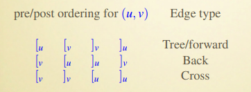
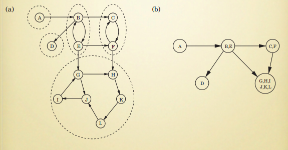

# 算法原理复习笔记

###### lgq part

## Graph Algorithms, Revisited

### Types of edges

+ 树边（tree edges），回边（back edges）
+ PREVISIT，POSTVISIT，遍历的到达时间和离开时间
+ 前向边（forward edges），交叉边（cross edges）

### Directed Acyclic Graph (DAG)

+ Linearization / Topologically Sort

  All DAGs can be linearized

  按 post number（遍历离开的时间）降序排列

+ 无环，可线性化，没有回边 are the same thing

+ Every DAG has at least a source and a sink

### Strongly Connected Components (SCC)

+ 有向图中 **connected** 的定义：两个节点 u，v，u 可以到达 v，v 也可以到达 u。

+ Every directed graph is a DAG of its SCC

  

  将 SCC 视为一个节点后生成的图必是 DAG，否则如果出现环的话，说明环上的 SCC 节点应该是同一个节点。

+ SCC 中所有节点的 highest post number 可以**代表**一个 SCC：

  + highest post number 中最高的必定 lie in source SCC。
  + A 和 B 是两个 SCC，A 有边指向 B，则说明 A 中的 highest post number 高于 B 中的。
  + SCC 也可以线性化，方法是按 highest post number 大小降序排列。

+ 所有节点中的 highest post number 必定 lie in source SCC，但是 lowest post number 并不一定 lie in sink SCC，所以为了寻找 sink SCC，可以将原图中的边倒置。

### Dijkstra

+ input: directed or undirected, positive edge length，复杂度是 O(|V|)
+ Dijkstra 算法的关键是所有已遍历到的节点已经计算到了最小路径
+ 为了支持负边，引入 Bellman-Ford 算法，每次迭代都计算一遍所有的边，复杂度是 O(|V|·|E|)
+ 如果在 V-1 次迭代以后仍然没有收敛，则说明有负环
+ 在有负边的 DAG 中，仍然可以使用 Dijkstra 算法，只要按照线性化之后的顺序 update 即可。

##### Last-modified date: 2020.1.2, 2 p.m.