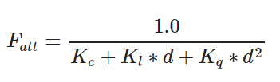
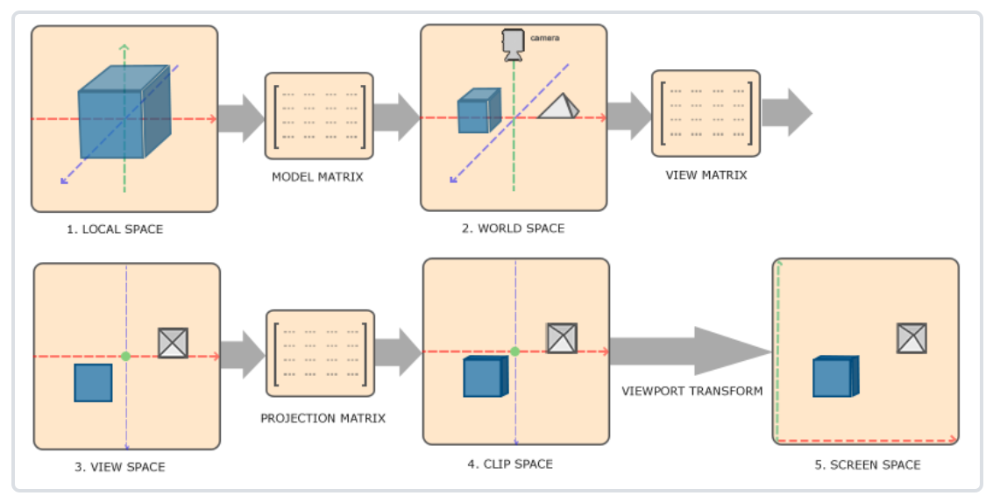
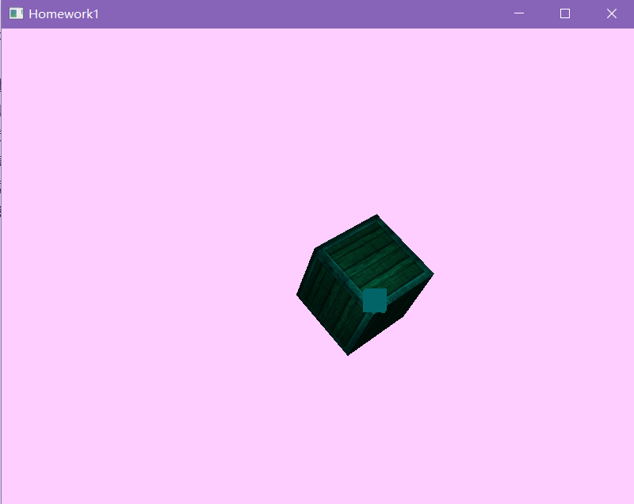

# homework 1  木箱行星

###### 陶伯承 517021910761

## 功能描述

有几个功能点：颜色渐变，物体旋转，光照模拟以及键鼠操作。

### 颜色渐变

背景色和光源发出的光的颜色随时间变化，且保持一定的色差使光源清晰可见。

光源发出的光照射在木箱上有一定的反射处理。

### 物体旋转

木箱绕光源公转的同时也在自转，模拟行星的运动。

### 光照模拟

光源发出颜色随时间变化的光，照射在木箱上，采用环境光照分量 + 漫反射光照分量 + 镜面光照分量的模型模拟出光照效果。

同时，使用镜面光贴图对木箱的木质表面和钢制边缘进行精细的镜面高光控制，使钢制边缘看上去更加闪闪发亮。

### 键鼠操作

通过 W（前），S（后），A（左），D（右），Q（上），E（下） 键控制 Camera 的位置，通过鼠标控制 Camera 的角度，通过滚轮控制镜头的放大缩小，通过 ESC 键退出。

## 具体工作

+ 学习 OpenGL 基础知识
+ 搭建 OpenGL 编程环境
+ 构造模型矩阵、观察矩阵、投影矩阵
+ 编写着色器
+ 调整渐变、旋转及光照衰减参数
+ 编写键鼠操作处理函数
+ 应用纹理

## 技术方案

+ 为了实现颜色渐变、物体旋转等随时间变化的功能，采用的方案是在渲染循环中获取当前时间，用正余弦将值控制在 -1.0f ~ 1.0f 之间再做进一步处理。

+ 光照模拟中，由于光源不再是白色，而是舍弃了一些通道中的部分值以达到彩色的效果，所以亮度会有所降低，采用的解决方案是调整光照衰减参数，使亮度降低得到一定补偿。

  

+ 为了更方便地实现木箱的公转自转以及 Camera 的键鼠操作，引入坐标系统，即模型矩阵、观察矩阵和投影矩阵来进行顶点变换。

  

+ 为了实现木箱的视觉效果，引入纹理；为了实现不同的镜面高光效果，引入镜面光贴图。

  

      
      
  

+ 开启深度测试以避免木箱旋转到光源后方时，光源被木箱错误地遮挡。

  

