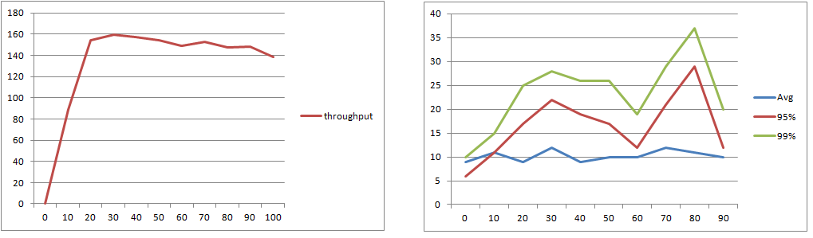
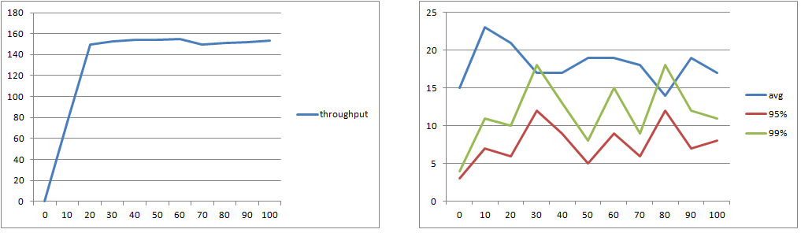
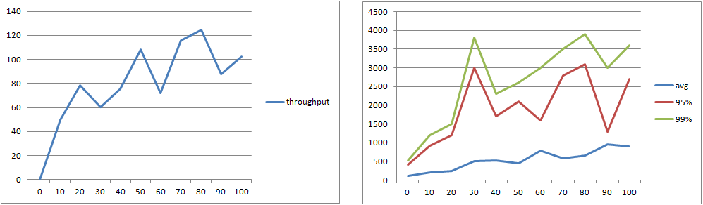
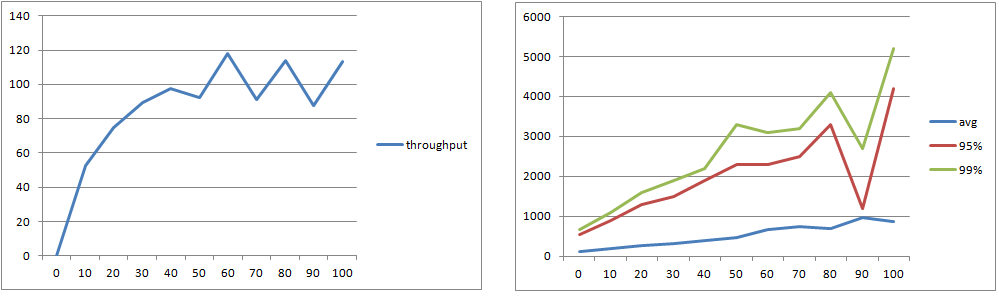

# CSE hands-on notes

## [Hands-on 1  Domain Name Service](<https://ipads.se.sjtu.edu.cn/courses/cse/handson/handson-1.html>)

+ 提供一层域名到 IP 地址的映射，使人们能够使用更加友好也更加灵活的域名而不是难以记忆的 IP 地址。

+ record 有几种不同类型

  + `A` ：默认类型，查询域名的 IP 地址
  + `NS`：查询域名的权威 name server
  + `CNAME` ：查询域名的别名

+ `dig @8.8.8.8 www.baidu.com`

+ 先用该命令查询：

  ```bash
  dig lirone.csail.mit.edu +norecurs
  ```

  第一次查询只能得到 edu 的 name server： `a.edu-servers.net.` ，然后再向这个 name server 查询：

  ```bash
  dig @a.edu-servers.net. lirone.csail.mit.edu +norecurs
  ```

  就能得到 mit.edu 的 name server，如此反复就能解析出域名对应的 IP 地址。

+ twitter 解析出的 IP 地址每次都不一样而且 ping 不通，应该是墙的原因；加上 `@1.0.0.0` 就可以，可能是因为 1.0.0.0 是一个国外的 IP。

+ 解析出的 IP 每次都不一样，还是墙的问题。

## [Hands-on 2  Write Ahead Log System](<https://ipads.se.sjtu.edu.cn/courses/cse/handson/handson-2.html>)

+ 因为 action 2 没有 end

+ studentA 1000

+ 因为 action 3 的操作没有 end

+ studentC: 3100, studentA: 900，因为 action 3 commit 过，在 recover 的时候不会被 undo

+ yes

+ Losers 是指没有 commit，被 undo 掉的 action

  Winners 是指 commit 过，没有被 undo 的 action

  Done 是指原本就已经 end 过的 action

+ 因为 checkpoint 命令不会把数据 install 进 db

+ 6 lines，recover 的时候可以不用遍历整个 log

+ yes，幂等性

+ commit 过的 action 就不会被 undo

+ 会将没有 commit 的 action abort 掉

## [Hands-on 3  Load Balance and Reverse Proxy](<https://ipads.se.sjtu.edu.cn/courses/cse/handson/handson-3.html>)

+ 当负载不断增大时，吞吐量不再上升甚至会下降。

  

+ 用 nginx 做负载均衡，减少 latency

  

+ 提升 replica 数量，但是需要 redis 维护 session 信息，可能会提高 latency

  

+ 限制 CPU 为 0.5，latency 提高了

  

##### Last-modified date: 2019.12.16, 12 p.m.

