# CSE lecture notes

## Lecture 1  Introduction - System Complexity

+ system complexity
  + emergent properties (surprise)
  + propagation of effects (butterfly effect)
  + incommensurate scaling 
  + trade-offs
+ coping with complexity -- **MALH**
  + **M**odularity
  + **A**bstraction
  + **L**ayering
  + **H**ierarchy

## Lecture 2  Inode-based File System

Seven layers abstraction

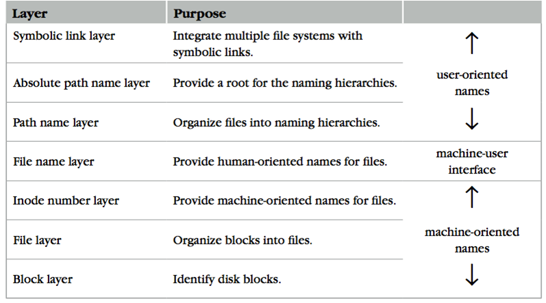

### Block layer

block number -> block data

+ One superblock per file system

### File layer

inode -> block numbers

inode + offset -> block number

### Inode number layer

inode number -> inode

+ inode number is the *index* of inode table

  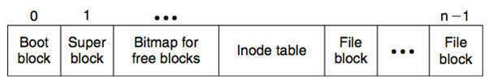

### File name layer

dir + filename -> inode number

+ filename in current dir
+ Mapping table is saved in directory
  + This means if an inode serves as a **directory**, its blocks store a **table** mapping filename and inode number, and if it serves as a **file** instead, its blocks store pure **data**.

### Path name layer

dir + path -> inode number

+ path starts from current dir
+ path can be deeper than filename
+ Users cannot create links to directories, (avoiding a cycle) but except for `.` and `..`

### Absolute path name layer

path -> inode number

- path can be absolute or relative
- root inode number is **1**
- Both `/.` and `/..` are linked to `/`

### Symbolic link layer

## Lecture 3  File System API

## Lecture 4  Disk I/O

+ polling -> interrupts -> hybrid
+ DMA
+ PIO / Memory-mapped I/O

## Lecture 5  File System Design

+ FFS  Cylinder group
+ New Storage and Media

## Lecture 6  Crash Consistency

### MTTF & Availability

+ MTBF = MTTF + MTTR
+ MTTF 和 Availability 是相互正交的两个概念，可以 MTTF 很大而 Availability 很小，也可以 MTTF 很小而 Availability 很大。

### Redundancy

+ Coding - Hamming Distance
+ Replication
+ Voting - NMR (N-modular redundancy)
+ Repair

### Magnetic disk fault tolerance

+ RAID

### FSCK

### Logging / Journaling

+ D -> Jm -> Jc -> M，在 commit 之前，新 metadata 不会覆盖旧 metadata，可以很方便地回滚。
+ 不 flush -> probabilistic crash consistency，但是在某些 workload 下会有问题，有两种方案：
  + checksum，可以去掉第一个 checksum
  + delayed writes，可以去掉第二个 checksum

## Lecture 7  RPC & NFS

### RPC

+ stub
+ UDP header
+ marshal / unmarshal

### NFS

+ file handler
  + file system identifier
  + inode number
  + generation number
+ stateless on NFS server

## Lecture 8  GFS

+ Master does not use any per-directory data structures
+ Contains chunks (blocks, each 64MB) of a fixed size

### read

    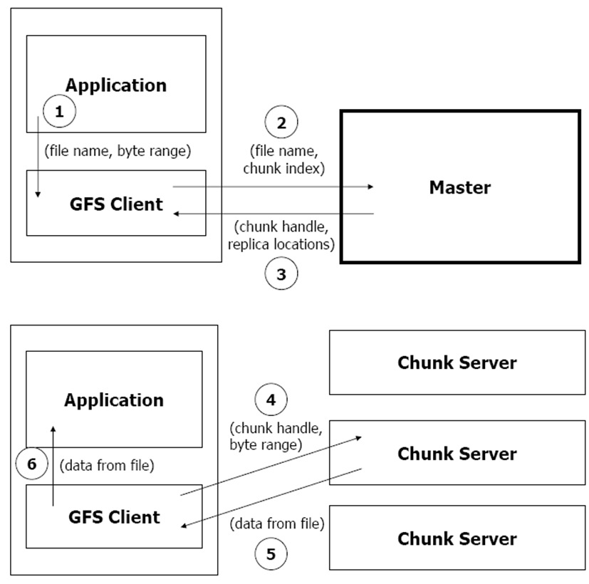

### write

    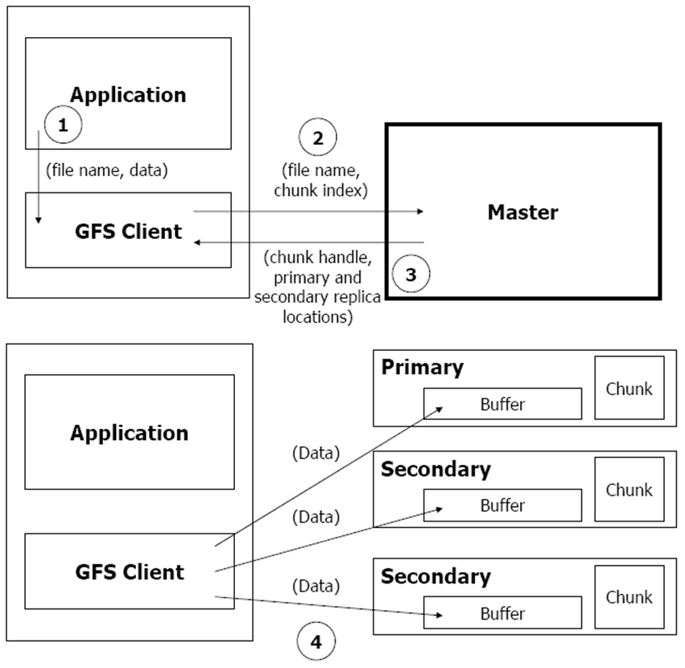
    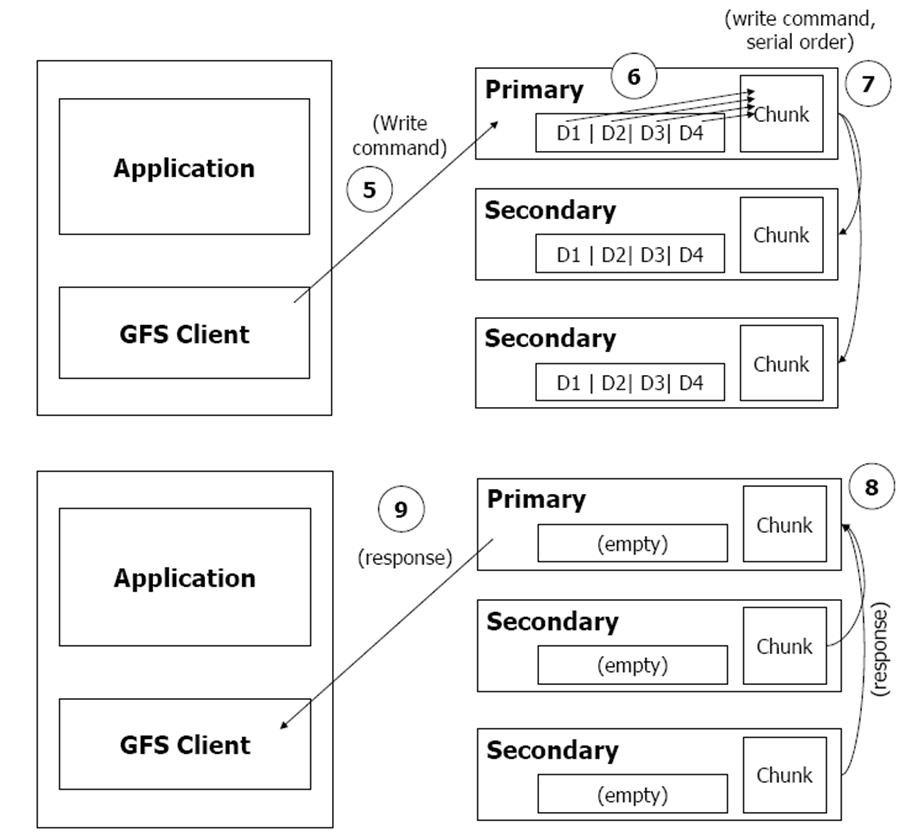

## Lecture 9  CDN & DNS

## Lecture 10  Introduction to Network and Link Layer

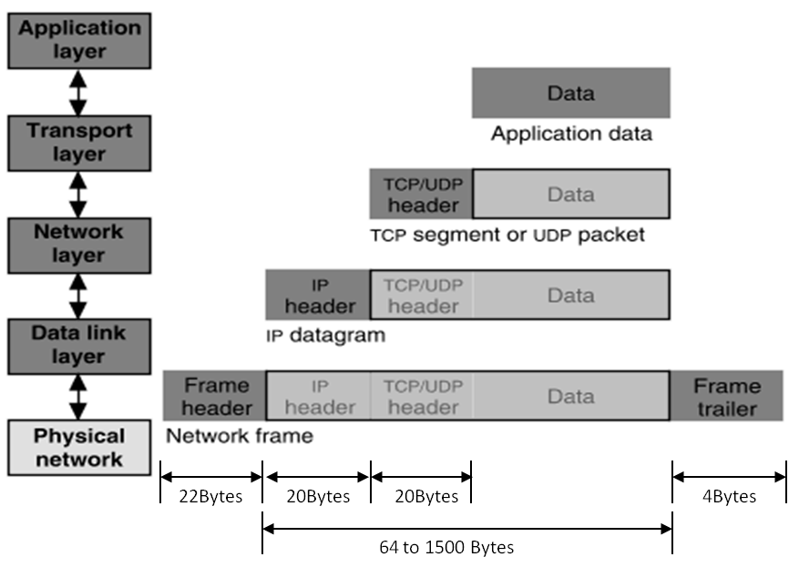

### Application Layer

+ Entities: client and server
+ Namespace: URL

### Transport Layer

+ Entities: sender and receiver

+ Namespace: port

+ TCP: Retransmit packet if lost

  UDP: Nothing

  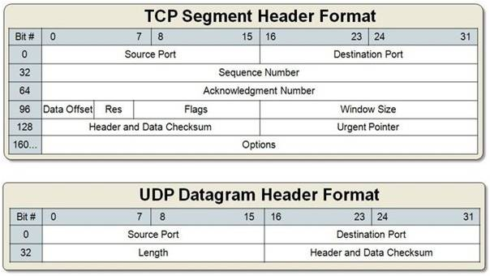

### Network Layer

+ Entities: gateway, bridge, router...
+ Namespace: IP address
+ What to care: next hop decided by route table

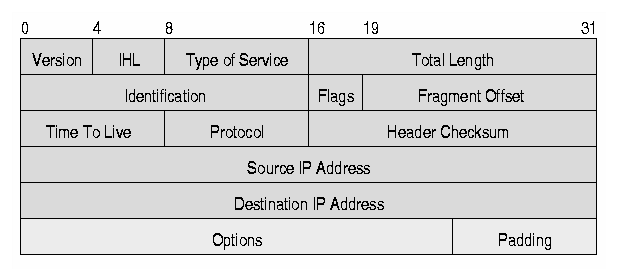

### Link Layer

+ Entities: hub, switcher, twisted line, cable line...
+ Namespace: no name needed
+ What to care: physical transfer, error detection

### Link Layer Detail

#### Physical transmission

- parallel transmission
- serial transmission
- VCO
- Manchester Code 0 -> 01, 1 -> 10

#### Multiplexing the link

- Isochronous communication
- Asynchronous communication

#### Framing bits & bit sequence

+ Choose a pattern of bits, e.g., 7 one-bits in a row, as a frame-separator (where a frame
  begins and ends)
+ Bit stuffing: if data contains 6 ones in a row, then add an extra bit 0

#### Detecting transmission errors

+ fault tolerancy -> redundancy
  + simple parity check (2 bits -> 3 bits)
  + 4 bits -> 7 bits

#### Providing a useful interface to the up layer

## Lecture 11  Network Layer

+ IP: Best-effort Network

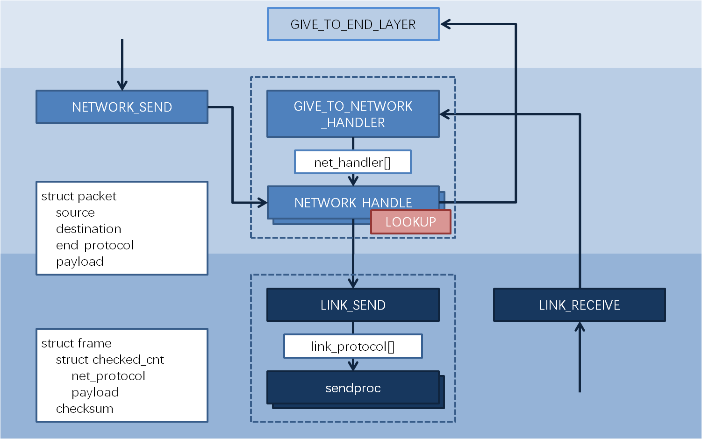

### NAT

+ Network Address Translation

  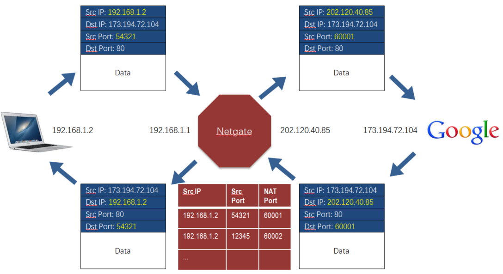

## Lecture 12  Network Layer: Routing

+ 为了实现冲突检测，包的最小长度要满足接收这个包的时间大于包传递的最大延迟，这样即可保证在一个包发出和接收的两个时刻之间没有其他包被发出。
+ 路由器和交换机的区别：
  + 路由器：网络层，IP 地址，不同网段
  + 交换机：链路层，MAC 地址，同一网段
+ IP 地址和 MAC 地址的区别：IP 地址本质上是终点地址，它在跳过路由器（hop）的时候不会改变（NAT 除外），而 MAC 地址则是下一跳的地址，每跳过一次路由器都会改变。

### ARP

+ Address Resolution Protocal
+ Name mapping: IP address <-> MAC address
+ ARP Spoofing / Man-in-the-Middle Attack: 污染 ARP cache，使得包被发往错误的 MAC 地址。

### Routing

构建路由表的两种方法：

+ Link-state Routing： 告诉所有节点自己到邻居的距离（只需要告诉一次就能在每个节点构建出网络拓扑）
+ Distance-vector Routing： 告诉邻居节点自己到所有节点的当前距离（当前距离是指可能会经过多次更新，路由表才会到达最优状态）

#### Problem of Infinity

由于 Distance-vector Routing 方法中不同节点的传播顺序不同，有可能会造成明明两个节点之间的网络已经崩了，但是还能通过另一个节点的数据虚假地恢复出来，而且和不可通信的节点之间的距离会不停增大。

Split Horizon 是一个尝试性的解决方案，即如果路由表中的某条记录是某个节点告诉我的，那我就不再把这条记录告诉那个节点，但仍然不能彻底解决这个问题。

#### Scale to Internet

+ Path Vector Exchange：不仅告诉邻居自己到所有节点的当前距离，还告诉他们这些距离是经过哪些节点走出来的。
+ Hierarchical Address Assignment：引入层级结构，简化路由表。
+ Topological Addressing：进一步简化路由表，CIDR Notation，子网掩码。

## Lecture 13  End-to-end Layer

### BGP

+ Border Gateway Protocal
+ Customer / Provider / Peer

### End-to-end layer

+ No "one size fits all": UDP / TCP / RTP

#### Assurance of at-least-once delivery

Remember state at the **sending side**

RTT (Round-trip time) = to_time + process_time + back_time (ack)

How to decide timeout ?

+ Fixed timer: Evil
+ Adaptive timer
+ NAK (Negative ACK)

#### Assurance of at-most-once delivery

Maintains a table of nonce at the **receiving side**

Tombstones

#### Assurance of data integrity

data integrity: Receiver gets the same contents as sender

Checksum

#### Assurance of stream order & closing of connections

when out of order: receiving side window

#### Assurance of jitter control

#### Assurance of authenticity and privacy

#### Assurance of end-to-end performance

+ Lock-step

+ Pipeline

  + Fixed window

  + Sliding window

    window size = round-trip time * bottleneck data rate

### TGP Congestion Control

Network & End-to-end layers share the responsibility for handling congestion

#### AIMD

+ Additive Increase, Multiplicative Decrease

+ retrofitting: slow start

+ AIMD leads to efficiency and fairness

  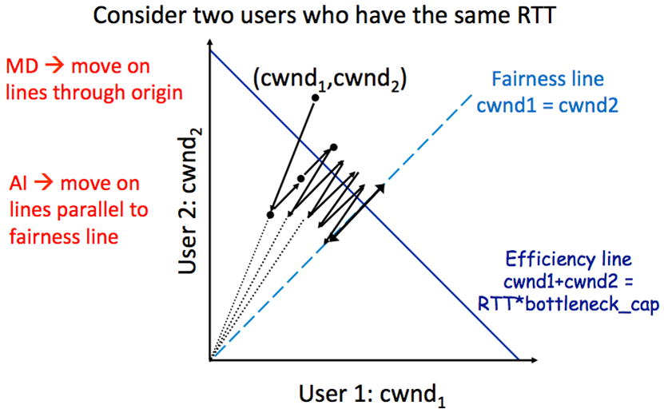

## Lecture 14  Transaction

### CAP

+ Consistency, Availability, Partition Tolerance
+ P：通常是一个事实
+ C 和 A 并不是 0 或 1 的选择

### All or Nothing

+ commit point

#### shadow copy

+ work well for a single file

#### logging

+ Basic operations: begin, write, read, commit, abort
+ 在 all or nothing 的 context 中，不考虑某一个变量还未 commit 就在另一个 transaction 中被写的情况

#### log + cell

+ Write-ahead-log protocol: WAL

  log the update before installing it

+ recovery: undo，因为 cell 里的数据有可能没有 commit

#### Optimization

+ log + cell + cell cache

  recovery: undo + redo，因为 disk cell 里的数据可能没有 commit，也有可能不是最新的

+ truncate the log

  + checkpointing
  + non-quiescent checkpointing

+ external synchronous I/O 

  It will not be flushed until something externally visible happens

## Lecture 15  Before or After

+ race condition

### Serializability

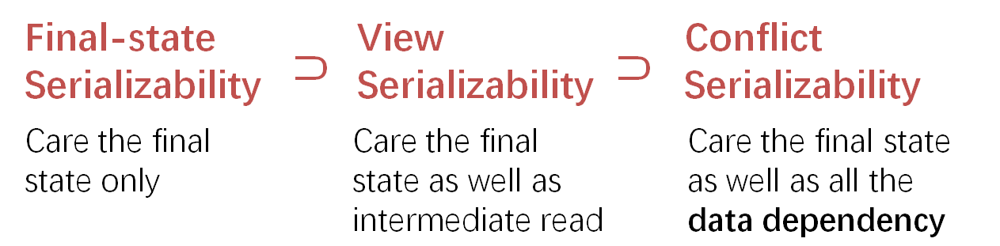

+ Conflict Graph

  A schedule is conflict serializable if and only if it has an **acyclic** conflict graph

+ A schedule is conflict / view serializable if it is conflict / view equivalent to some **serial** schedule

+ Conflict Serializability VS. View Serializability

  conflict serializability has practical benefits

### Generate Conflict-Serializability Schedules

+ pessimistic: global lock, 2-phase locking
+ optimistic: optimistic concurrency control (OCC)

#### Global Lock

+ system-wide locking

#### Simple Locking

+ data-wide locking

#### Two-phase Locking

+ After transaction releases a lock, it cannot acquire any other locks.
+ 2PL Can Result in Deadlock

#### Optimistic Concurrency Control

1. Concurrent local processing 
2. Validation in critical section
3. Commit the results in critical section or abort

## Lecture 16  Lock & Memory Model

+ Peterson's Algorithms: no use any more due to problem of memory consistency

### Memory Consistency Model

+ Strict Consistency：只要某个线程写了，其他所有线程可以立刻读到

+ Sequential Consistency：某个线程写了，其他线程可以不用立刻能读到，只要这个顺序看上去和顺序读写的顺序一样就行，考虑了 write 的 latency

  

      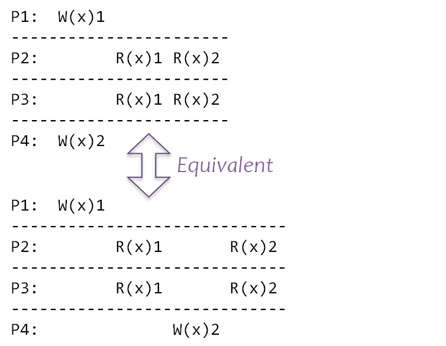
      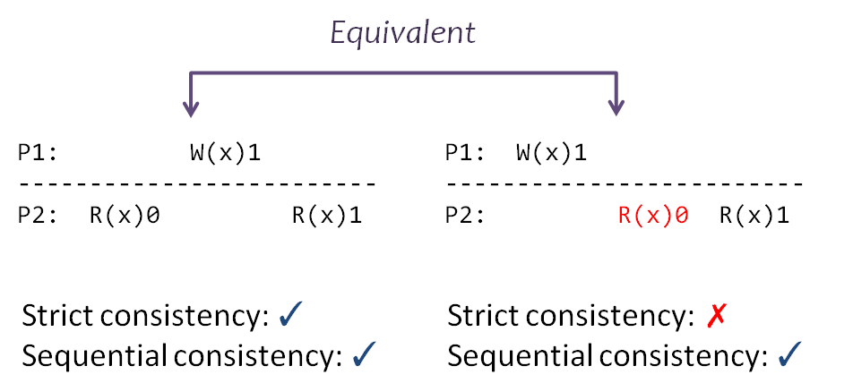
  

+ Processor Consistency：不同的线程读不同线程写的数据顺序可以不一样，考虑了 network 的 latency

### Atomic Instructions

+ atomicity by hardware
+ TestAndSet
+ CompareAndSwap
+ LoadLinked / StoreConditional 
+ FetchAndAdd

### Lock Granularity

+ Coarse-grain vs. Fine-grain

### Deadlock

+ Lock ordering (pessimistic)
+ Backing out (optimistic)
+ Timer expiration (optimistic)
+ Cycle detection (optimistic)

## Lecture 17  Thread & Condition Variable

### Yield()

1. suspend running thread
2. choose new thread
3. resume thread to run

但即使用了 yield，当有很多 sender 在等的时候也会做很多 unnecessary check，所以更好的做法是让 sender 去睡觉

### Conditional Variable

有了 conditional variable，等待的 sender 就可以去睡觉，但是为了让 release-wait-acquire 变成一个原子操作（解决 Lost-notify Problem），把 wait 接口改成可以接受一个 lock 参数，并引入新接口：yield_wait()。

但是因为引入了新状态 WAITING，在 yield_wait() 选择新线程的时候有可能会因找不到 RUNNABLE 的线程而陷入死锁，所以要在 while 循环中放锁再拿锁。

但是在放锁拿锁的间隙，另外一个 CPU 可以来执行同一个线程，这会导致两个 CPU 的栈指针指向同一块内存，一个 CPU 执行完操作更改了栈后，另一个 CPU 的栈指针会被污染，所以要在进入 while 循环前保存当前 CPU 的栈指针，使其指向一个相对私有的内存。

### Preemption

再考虑 preemption 的问题，在拿着 t_lock 的时候即使由于时间片用完被调度走了，别的线程也拿不了锁，所以在拿锁放锁的时候相应地关闭开启 interrupt（注意开关中断和拿放锁的顺序）

但是在放锁拿锁的间隙（while 循环中），也同时是开启中断的间隙，时间片用完被调度走了，当前 CPU 执行另一个线程，另一个线程在 yield_wait() 的第一行会拿到错误的 id，所以要在先前线程进入 while 循环前将其设为 null。

## Lecture 18  Thread Layer & Processor Layer

+ Thread Exit:

  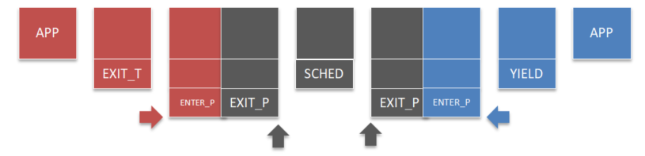

+ Context Switch:

  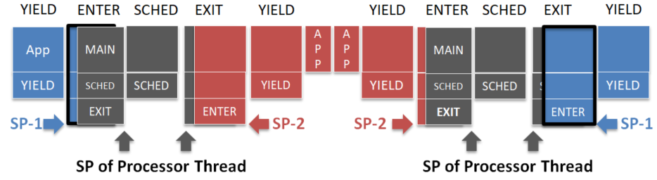

    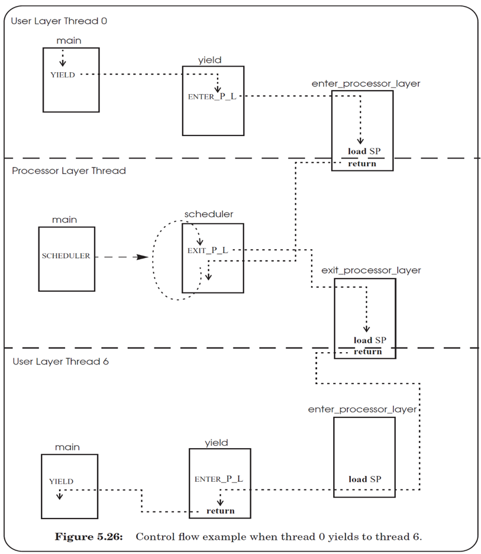

## Lecture 19  Atomicity across Multiple Sites

client + coordinator + two servers

### Two-phase Commit

+ phase-1: preparation / voting：Lower layer 准备就绪
+ phase-2: commitment：Higher layer 确认 commit

可以嵌套，higher layer 可以是更上层的 lower layer

3N messages

### Replication Consistency

#### Optimistic Replication

use timestamps

Time measuring: measure time intervals (fixed-frequency oscillator)

Synchronize a clock over the Internet: NTP, but need to take into account network latency

There exists a principle: time never goes backwards

File Reconciliation

Vector Timestamps

#### Pessimistic Replication

Quorum: Qr + Qw > Nreplicas

##### Last-modified date: 2019.11.25, 11 p.m.

