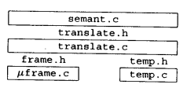

# 编译原理学习笔记

## 第 1 章  绪论

+ **直线式程序** (straight-line program) 语言：有语句和表达式，但是没有循环和 if 语句，比如：

  ```
  Stm -> id := Exp
  ```

+ 表达式序列 `(s,e)` 的行为类似于 C 语言中的逗号操作符，在计算表达式 `e` 之前先计算语句 `s` 的**副作用**。所以 `s` 中的赋值操作有可能会影响 `e` 的结果。

### Lab 1: Straight-line Program Interpreter

+ `.h` 文件中最好不要写函数的实现，因为实现的代码有可能会调用别的类的方法，而在头文件中只有别的类的方法的定义而没有实现，会报错。

  因为是在 `.cpp` 文件中引用 `.h` 文件，编译时刻 `.h` 文件找不到 `.cpp` 文件。

+ `std::cout` 需要引入 `<iostream>` 库。

+ 报错 `'nullptr' was not declared in this scope` 有可能是 CMake 版本过低。

+ 在以 `a->f(x)` 这样的方式调用函数并返回 `x` 时，需要小心 `x` 是否改变，如果没变，极有可能应该写成

   `new_x=a->f(x)` ，然后返回新的 `new_x`。

+ 如果有这样的写法：

  ```c++
  a = f()->a;
  b = f()->b;
  ```

  最好能写成：

  ```c++
  sometype *tmp = f();
  a = tmp->a;
  b = tmp->b;
  ```

  避免执行两次 `f` 带来预料之外的错误。

## 第 2 章  词法分析

+ 两条重要的消除二义性的规则：最长匹配，规则优先。

### 正则表达式 => NFA

五种基本转换：

+ for ε
+ for input a
+ for AB
+ for A | B
+ for A*

### NFA => DFA

+ 先确定 DFA 的 start state：NFA 的 start state + 从该 start state 出发经过 ε 可到达的 state。
+ 再确定 DFA 的其他 state：从 DFA 的 start state 群中任一 state 出发，经过某 transition 和任意数量的 ε 可到达的 state。

### 用 ㅣ，ㅜ，ㅗ 做词法分析

+ ㅣ 表示当前 lexeme 的起始位置
+ ㅜ 表示遇到的最后一个 final state 的位置
+ ㅗ 表示当前扫描到的位置

开始新一轮扫描后，ㅣ不变，ㅜ，ㅗ 往前扫描，遇到 final state，ㅜ 停下，ㅗ 继续往前扫描，再遇到 final state，更新 ㅜ 位置，ㅗ 继续往前扫描，直到在状态机图中走不通为止，将ㅣ，ㅗ 都置于 ㅜ 所在的位置。

### Lab 2: Lexical Analysis

+ ctrl + A （^A）对应的 ascii 码是 1，^B 是 2，以此类推。
+ atoi 的参数的第一个字符似乎要求是数字或者正负号，不然会转换失败，至少第一个字符是 `\` 不行。
+ `"{digit}"` 匹配由这七个字符本身构成的字符串，`{digit}` 匹配 0 ~ 9 （如果前面定义了的话）

## 第 3 章  语法分析

+ 终结符（terminal）：该语言字母表中的单词

  非终结符（nonterminal）：出现在产生式左侧的符号

### 预测分析

+ 递归下降：将每一个产生式转变成递归函数中 switch 下的一个 case 子句。

  递归下降分析也称为预测分析，它只适合于每个产生式右侧的第一个 terminal 能够为产生式的选择提供足够信息的那种文法。

+ 确定 FIRST 和 FOLLOW 集合的方法：

  1. 首先确定每个非终结符是否 nullable。
  2. 然后确定每个非终结符的 FIRST 集合，这一步需要用到 nullable 信息。
  3. 最后确定每个非终结符的 FOLLOW 集合，这一步需要用到 nullable 和 FIRST集合的信息。

  （确定 FIRST 和 FOLLOW 集合的时候可以针对每个终结符来判断，即该终结符是不是属于某个集合，这样条理更清楚一些）

  这种方法和书上不一样。书上的方法是一遍一遍扫文法，每一遍都扩充集合直到集合不再变化，这种算法更适合程序实现，手工求的时候太费时间；而上述方法中每一步做完相应的 nullable 或者集合在之后就不会再改变，而且每一步更加灵活，适合手工求集合。

+ 利用 FIRST 和 FOLLOW 集合构造预测分析表，若表中不含多重定义的项，则称该文法为 LL(1) 文法，即从左至右分析、最左推导和超前查看一个符号。

+ 若预测分析表中含有多重定义的项，可以有两种方法来解决：

  + 消除左递归

    考虑这么两个产生式：`E->E+T` 以及 `E->T` ，当遇到一个 `T` 时，无法确定选择哪个产生式，所以引入一个新的非终结符 `E'` ，并将产生式重写为 `E->TE'`, `E'->+TE'`, `E'->ε` 。

  + 提取左因子

    考虑这么两个产生式：`S->if E then S else S` 以及 `S->if E then S`，当遇到一个 `if` 时，无法确定选择哪个产生式，所以引入一个新的非终结符 `X`，并将产生式重写为 `S->if E then S X`, `X->else S`, `X->ε`。

### LR 分析

#### LR(0) 分析

分析步骤：

1. 从初始状态开始，对每一个状态的每一项，利用 Goto 找到下一个状态，画出 DFA
2. 根据 DFA 画出分析表：
   + 圆点位于产生式末尾：放置规约动作
   + 圆点位于终结符左边：放置移进动作
   + 圆点位于非终结符左边：放置转换动作

#### SLR 分析

和 LR(0) 分析的不同之处在于：

+ LR(0) 分析中，只要某一状态中有一项圆点位于产生式结尾，就在分析表中这一个状态的那一行全部放置规约动作
+ SLR 分析中，不仅要圆点位于产生式结尾，还要超前查看的符号属于产生式左部非终结符的 FOLLOW 集合，才会在由这一个状态的那一行和这一个超前查看符号的那一列确定的位置放置规约动作。

#### LR(1) 分析

和 SLR 分析的不同之处在于，确定在哪一个位置放置归约动作不再靠检查超前查看符号是否属于 FOLLOW 集合，而是对于每一个状态每一项，都记录一组符号，当超前查看符号是这一组中的某个符号时，放置归约动作。

#### LALR(1) 分析

和 LR(1) 分析的不同之处在于，LALR(1) 分析忽略了记录的那一组符号，即如果在不看那一组符号而只看产生式的情况下，两个状态中的所有项都相同，则认为它们是同一个状态，将它们合并，这样可以得到一个较小的分析表。

### 分析器的生成器：Yacc

#### 冲突

默认情况下，Yacc 选择移进来解决移进 - 规约冲突，选择使用在文法中先出现的规则来解决规约 - 规约冲突。

#### 优先级指导

当遇到移进 - 规约冲突时，在移进一个**单词**和用一个**规则**进行规约之间存在选择，利用 Yacc 的优先级指导命令可以避免重写文法。

+ 单词的优先级为它们在声明时出现的顺序，越往下优先级越高。
+ 规则的优先级为规则右部最后出现的那个单词的优先级。（可用 %prec 赋予最高优先级）

定义好优先级后，我们便能判断到底是选择移进还是选择归约：

+ 当规则优先级较高时，选择归约；当单词优先级较高时，选择移进。
+ 当规则和单词优先级相等时（在同一行声明），如果它们由 %left 声明，选择归约；如果它们由 %right 声明，选择移进；如果它们由 %nonassoc 声明，产生一个错误。

#### 语法和语义

在语法分析阶段，不管是布尔表达式 be 还是算术表达式 ae 在文法中都应写成表达式 E，和语义有关的信息应该被推迟到语义处理阶段再解析。

### 错误恢复

#### 局部错误恢复：error 符号

遇到语法错误时，跳到下一个**同步单词**（比如右括号、分号），将同步单词前的错误部分作为 error 规约掉，然后继续分析。

#### 全局错误恢复：Burke-Fisher 错误恢复

在错误点之前 K 个单词的每一点，尝试用每一种可能的单词来进行插入、删除或替换。

该算法管理两个栈和一个队列：当前分析栈、旧分析栈和它们之间 K 个单词组成的队列。

+ 可以用 %value 命令指明插入每一种单词时使用的默认值。
+ 可以用 %change 命令给出关于首选尝试的建议。

## 第 4 章  抽象语法

+ Yacc 生成的语法分析器并行地维护着一个状态栈和一个语义值栈。
+ 为了记录单词在源程序中的位置，语法分析器应当同语义值栈一起维护着一个位置栈。Bison 能够做到这一点，但 Yacc 不能，一种解决方法是手动定义一个非终结符 pos，且 `pos->ε`。
+ Tiger 抽象语法中 pos 的选择可以根据个人的喜好。

### Lab 3: Parsing

+ typedec 和 fundec 可能是因为递归所以才需要 list
+ 在 `tiger.y` 中添加 `%debug` 可以开启调试模式

## 第 5 章  语义分析

### 符号表

+ 函数式风格 `y=f(x)`：创建新环境时，旧环境不变。
+ 命令式风格 `x.f()`： 在旧环境基础上创建新环境。

#### Tiger 编译器的符号

存在两个散列表的映射：字符串到符号和符号到绑定。

+ 字符串到符号（S_symbol[]）：Symbol 模块中的 hashtable 变量存储了这个散列表，

  Symbol 模块还负责了对 Table 模块的一层封装。

+ 符号到绑定（S_table）：Table 模块封装了这个散列表。（之后提到的符号表大多是指这个散列表）

可以通过修改 Symbol 模块的接口来使用不同的符号表风格。

### Tiger 编译器的绑定

Types 模块

Env 模块，环境是 S_table 类型的符号表

+ 类型环境（tenv）是符号到 Ty_ty 的映射
+ 值环境（venv）是符号到 E_enventry 的映射

### 表达式的类型检查

Semant 模块：trans 函数

### 声明的类型检查

在 Tiger 中，声明只出现在 let 表达式中。

### Lab 4: Type Checking

+ 打印错误信息：

  ```c++
  errormsg.Error(this->pos, "undefined type %s", this->typ->Name().c_str());
  ```

  不加 `c_str()` 的话直接打印 `std::string` 会出乱码

+ fg 的代码用的 for 循环，我用的 while 循环，对于 continue 的情况，for 循环能自动 ++，但是 while 不行（

## 第 6 章  活动记录

+ 如果一个变量存储在栈帧中，则称它是**逃逸**的。
+ 每当调用函数 f 时，便传递给 f 一个指针，该指针指向静态包含 f 的那个函数，称这个指针为**静态链**。



### Frame 模块

+ `F_frame`：栈帧的抽象表示，有关形式参数和分配在栈帧中局部变量的信息。

+ `F_access`：描述存放在栈中或寄存器中的形式参数和局部变量。

  可以由 `InFrame()` 和 `InReg()` 构造 `F_access` 对象。

+ `F_newFrame()`：返回一个新栈帧。

+ `F_allocLocal()`：分配一个新的变量。

+ `F_formals()`：返回形式参数的位置（从被调用函数的角度来看）。

### Temp 模块

+ `Temp_temp`：临时变量，局部变量的抽象名，暂时保存在寄存器中的值。
+ `Temp_label`：标号，静态存储器地址的抽象名，机器语言中的位置。

### Translate 模块

Translate 模块为 Semant 模块管理着局部变量和静态函数嵌套。

+ `Tr_access`：比 `F_access` 多知道一个与静态链相关的信息 (`Tr_level`)
+ `Tr_level`：嵌套层
+ `Tr_newLevel()`：创建新的嵌套层，调用 `F_newFrame()`
+ `Tr_allocLocal()`：在指定的层次中创建变量，调用 `F_allocLocal()`

管理静态链、追踪层次信息

## 第 7 章  翻译成中间代码

### 表达式的种类

创建一种抽象类型（`Tr_exp`）模拟三种表达式：Ex, Nx, Cx：

+ Ex：`T_exp`
+ Nx：`T_stm`
+ Cx：一个结构体，有 trues, falses, stm 三个字段，其中 trues 和 falses 是 patchList，stm 是真实的语句（`T_stm`），比如 `T_Cjump`

可以用 doPatch 函数来回填 patchList

unEx 接受一个 `Tr_exp` 类型的参数，将其转化为 `T_exp` 类型，unNx, unCx 同理，需要注意的是 unCx 应该拒绝来自 Nx 的转换

### 简单变量

在语义分析阶段的函数中只返回 `Ty_ty`，现在还需要返回每个 Tiger 表达式转换后的中间表示（`Tr_exp`）

函数 `F_Exp` 将一个 `F_access` 转换成 Tree 表达式，该函数接收两个参数，一个是 `F_access`，一个是该 access 所在栈帧的地址，对于 InFrame 的 access 来说，存有相对栈帧地址的 offset 的信息，所以将栈帧地址和 offset 相加即为该 access 的位置，再 mem 一下就能获得该位置处的值；对于 InReg 的 access 来说，存有 `Temp_temp` 信息，直接读寄存器即可。

### 追随静态链

如果变量 x 是在外层函数中声明的，就必须使用静态链来访问它，为了生成这个 x 的表达式，需要两个 level 信息：使用 x 的函数的 level 和声明 x 的函数 level，然后由里向外逐一使用各层的静态链位移信息。

注意：静态链位移一般设计成函数的第一个参数，然后真正的参数列表往后顺移一位。

### 数组变量

Tiger 中数组变量和记录变量都是指针。

### 结构化的左值

整数和指针值称为**标量**，因为它们仅占一个字的存储空间并可以放在寄存器中，Tiger 中所有的变量和左值都是标量，包括数组和记录（C 中数组是标量，而结构体不是）。

所以为了实现像 C 这样有结构化（非标量）左值的语言，需要在 access 中记录关于变量大小的信息。

实现 Tiger 编译器的时候为了简单不考虑这一点，但限制了 IR 的通用性。

### 下标和域选择

在不知道对 MEM 节点执行的是存还是取操作之前，我们将这个 MEM 看成是左值，因为在 IR 中，MEM 既可以表示存入，也可以表示取出。

### 关于安全性的劝告

数组下标越界检查

空指针检查（Nil）

### 算术操作

每个 Absyn 算术操作符对应一个 Tree 操作符。

Tree 语言没有一元算数操作符，整数的取负可以实现成 0 减去一个整数，但是浮点数的取负不能实现成 0 减去一个浮点数。

幸运的是，Tiger 语言不支持浮点数。

### 条件表达式

用 `T_Cjump` 可以从 Absyn 的比较操作符生成一个简单的 Cx。

对于 if a then b else c，可以将 a 视为 Cx，将 b,c 视为 Ex，但是 b,c 也有可能是 Nx 或 Cx，对于这些情况最好是单独做处理。

对于字符串的比较，需要调用系统库函数 stringEqual

### 字符串

对于每个字符串文字常数 lit，Translate 模块做两个操作：

+ 生成一个新的标号 lab，并返回这个标号的树中间表示 `T_Name(lab)`
+ 将片段 `F_String(lab, lit)` 放到一个全局表中

### 记录和数组的创建

记录的生存期可以长于创建它的那个过程的生存期，所以要将它们分配到堆中。

记录的创建过程是调用 malloc，然后将每个字段的初值填入对应的位置，最后返回 malloc 返回的地址。

数组的创建过程直接调用 initArray 即可。

### 声明

+ 对于变量的声明，应该返回一个赋值表达式

+ 对于函数和类型的声明，应该返回一个空操作表达式（`Ex(CONST(0))`）

+ 对于函数片段，存储两个信息：栈帧描述字（`F_frame`）和函数体（`T_stm`）

  （片段即是汇编中一个个 label，指明函数或者字符串）

## 第 8 章  基本块和轨迹

将任意一棵树转换成由 `T_stm` 组成的表的过程分为三步：

1. 将树重写为不含 SEQ 和 ESEQ 节点的规范树：Linearize
2. 将规范树分组组合成其内不含转移和标号的基本块集合：BasicBlocks
3. 对基本块排序并形成一组轨迹，轨迹中每一个 CJUMP 之后都直接跟随它的 false 标号：traceSchedule

## 第 9 章  指令选择

+ Maximal Munch：自顶向下，最佳覆盖（optimal）
+ 动态规划：自下而上，最优覆盖（optimum）

### AS 模块

+ `AS_instr` 用于表示 “没有指定寄存器的汇编语言指令”
+ `AS_oper` 包含汇编语言指令 `assem`，操作数寄存器表 `src`，结果寄存器表 `dst`，以及由可转移到的目标标号组成的一张表 `jump`。`assem` 是一个字符串，字符串中 ``s0` 即是对 src 列表中元素的引用，dst, jump 同理。
+ 函数 `munchExp` 返回一个存放结果的临时变量

##### Last-modified date: 2019.12.1, 10 p.m.