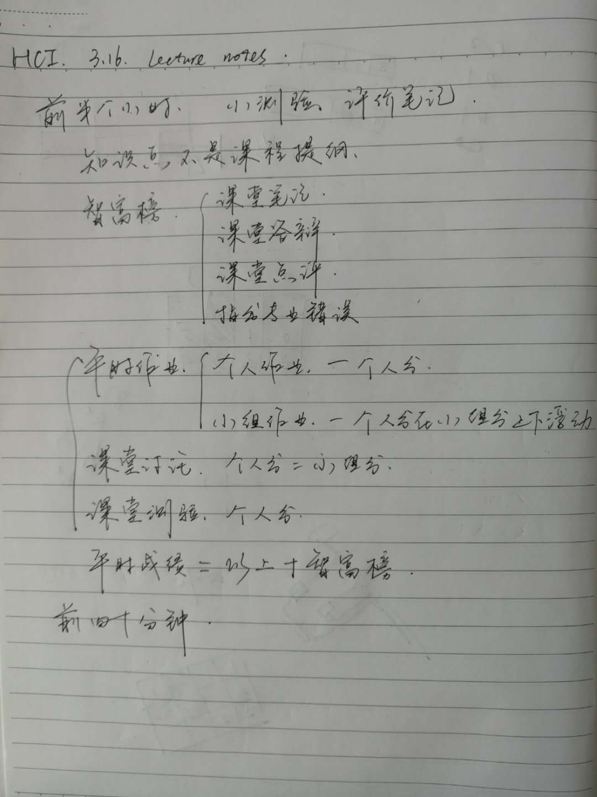
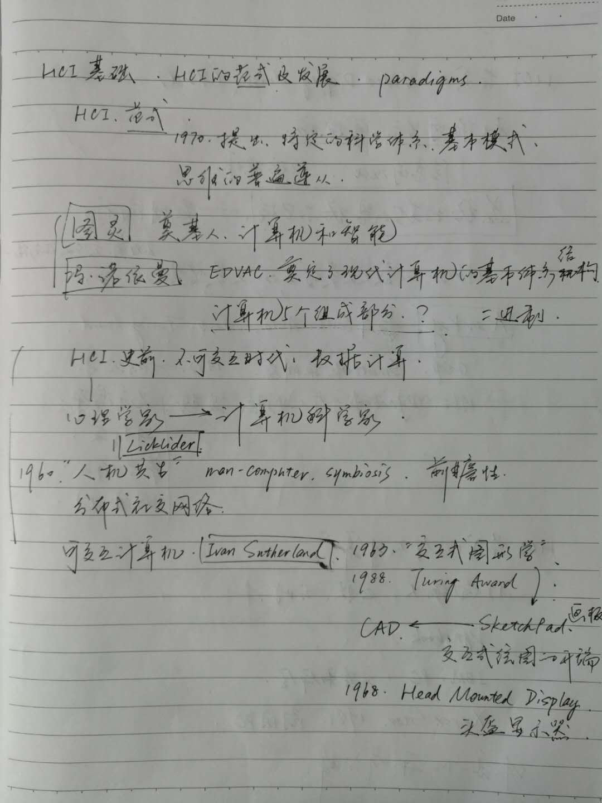
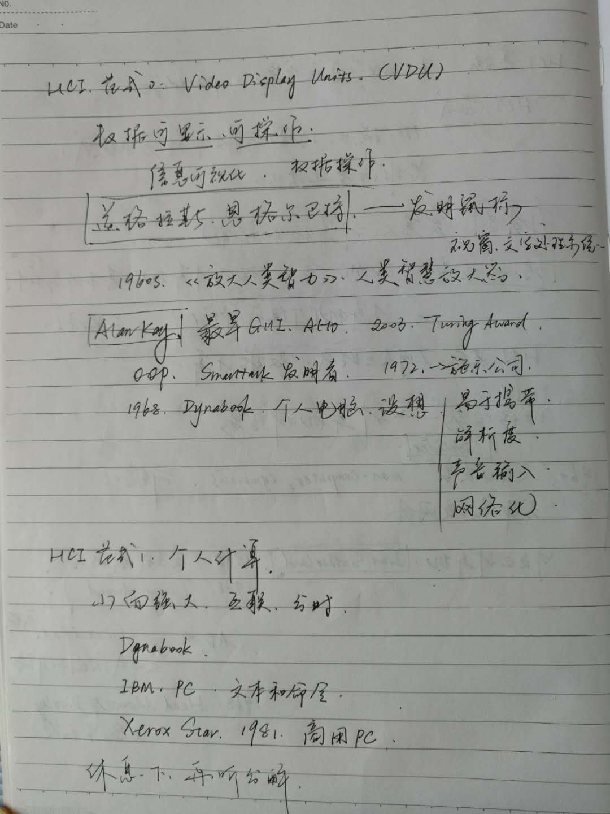
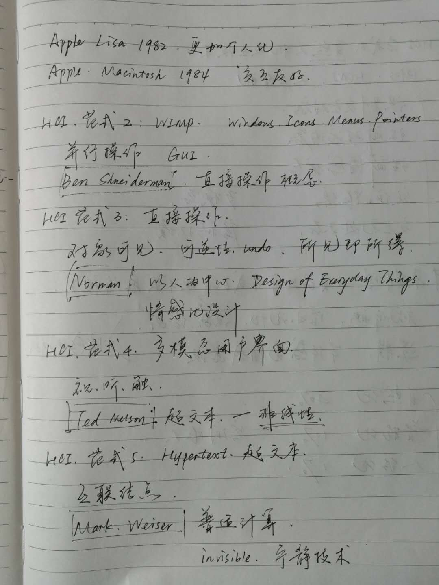
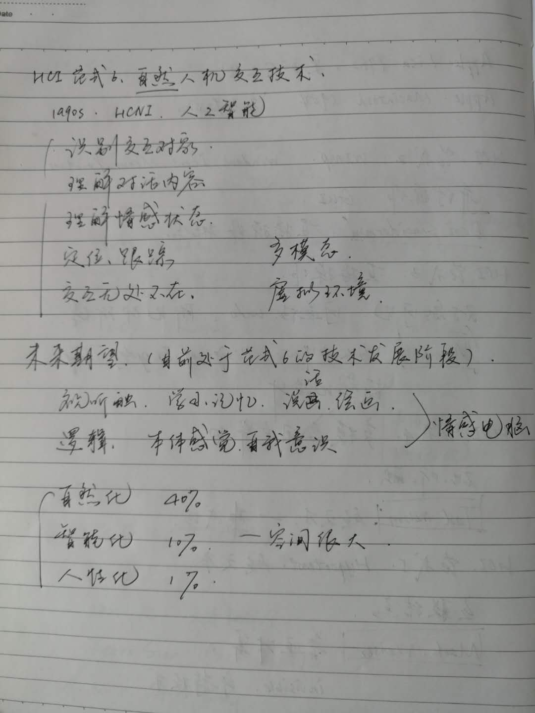
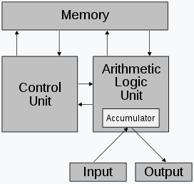

# 3.16 lecture notes

## 问题

+ 冯·诺依曼架构五个组成部分具体是指什么？

  运算器、控制器、存储器、输入设备、输出设备

  

  存储程序计算机在体系结构上主要特点有：

  1. 以运算单元为中心
  2. 采用存储程序原理
  3. 存储器是按地址访问、线性编址的空间
  4. 控制流由指令流产生
  5. 指令由操作码和地址码组成
  6. 数据以二进制编码