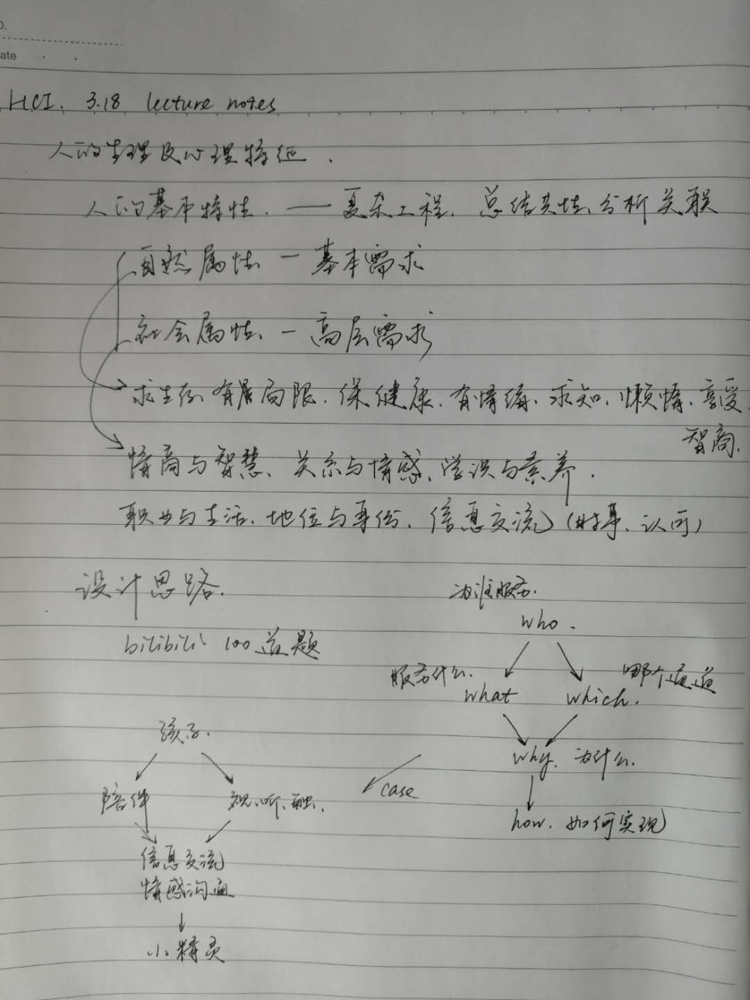
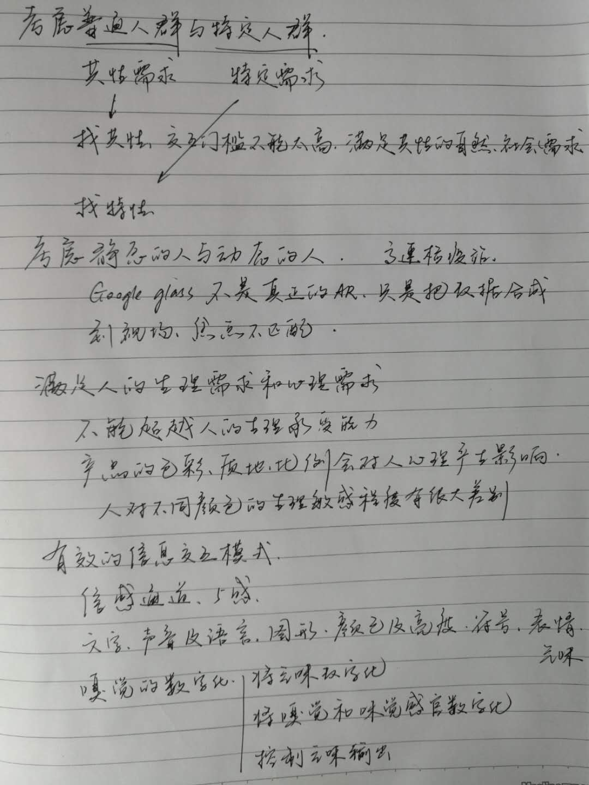

# 3.18 lecture notes

## 问题

+ 气味真的可以数字化吗，如果可以的话应该怎么做，性价比高吗

  医学研究已经证明气味是有最基本的维度的。而且基本的嗅觉维度比你想象的要少。大概只有六个。但是，现实中任何气味都是被这六个向量反复迭代的综合气味。有一种东西叫「嗅觉柱」，是一个六顶点的柱子，用来描述复杂气味的组成。

  和人类目前理解最透彻的视觉系统不一样，视觉有完整且发达的传导网络，成熟且专职的感受细胞，而嗅觉和味觉是靠受体感受的化学感觉，其中嗅觉是远感觉，针对的是外部环境；味觉是近感觉，针对的是具体对象。也就是说，对于人类来说，嗅觉存在的意义并不是分辨有多少种气味，而是给人类最基本的提示：这个东西有/没有气味！它能/不能吃！它好/不好吃！就这三点。

  因此，嗅觉对于人类，就像是一款宏大的3D游戏里的一段BGM。嗅觉更讲究临场感和情绪渲染。至今，嗅觉仍然不能被人类当做信息载体使用，比如视觉对应文字，听觉对应语言，但是，嗅觉，这种模糊的感觉很多情况下我们人类甚至不能去精确地定义它。我觉得，和人类已经发育成熟的「可编码感觉」如视觉和听觉相比，在VR技术上，没有必要通过编码的方式去重构嗅觉，那样工作量很大，取得的效果并不明显。