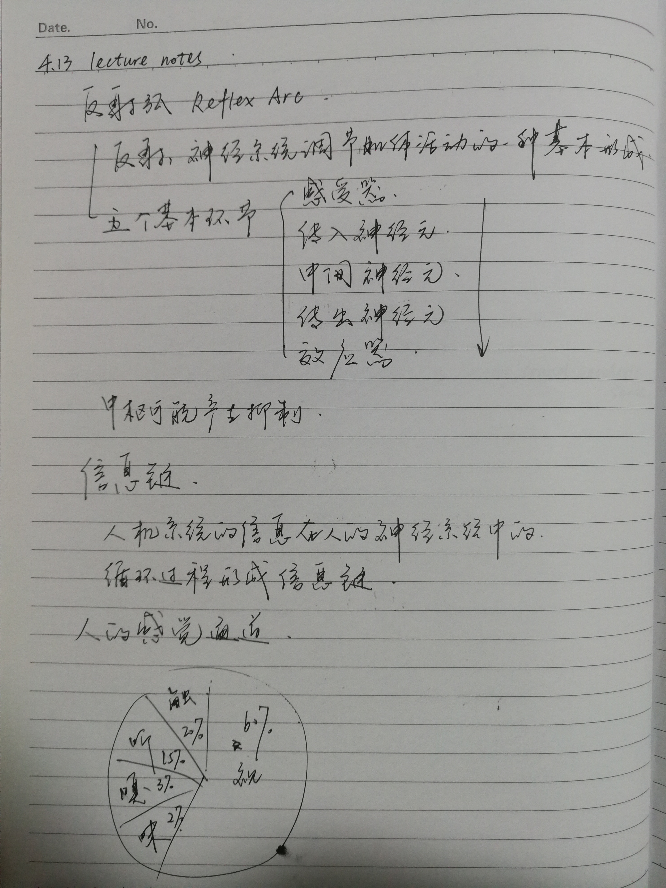
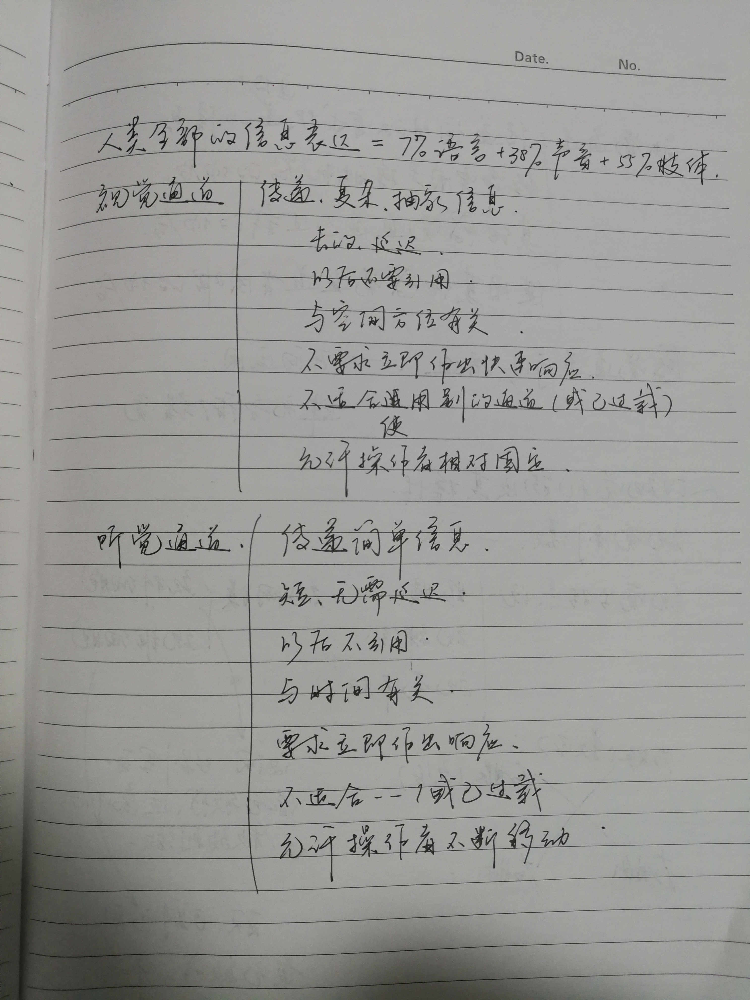
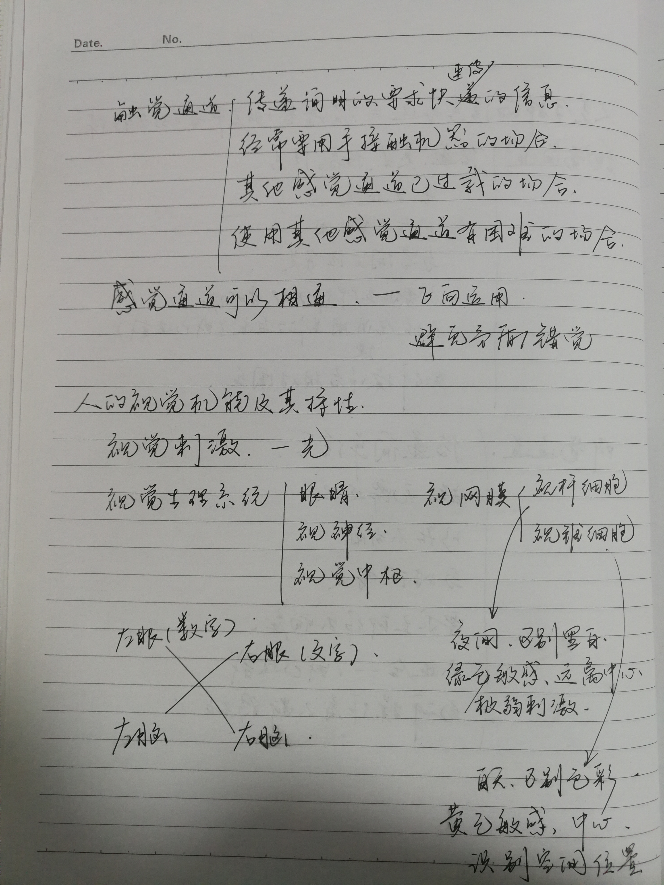
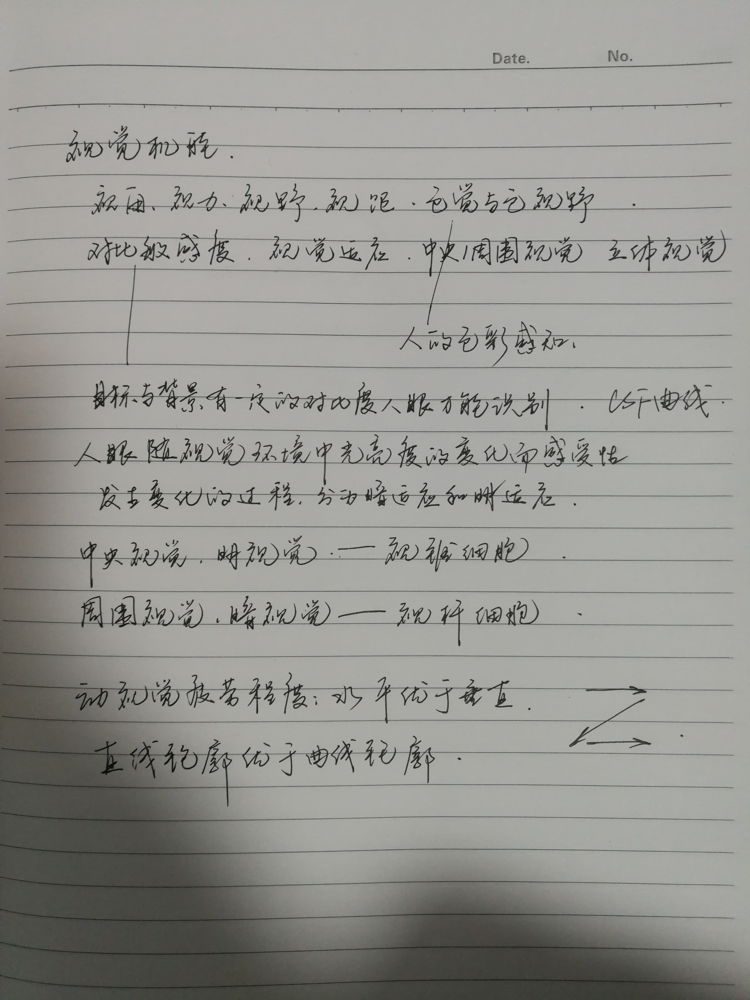

# 4.13 lecture notes

## 问题

+ **对比敏感度函数具体指什么？**

  对比敏感度函数 (contrast sensitivity function，CSF) 描述的是光栅的对比敏感度 (1/对比敏感度阈值) 随空间频率变化的规律，是在不同空间频率下对空间视觉进行基础的描述，它克服了视敏度对视功能检测的局限，为视功能的评估奠定了基础，将来有可能成为视功能检测的根本指标。因为视觉环境由不同对比度和不同空间频率的视觉刺激所组成，所以 CSF 更接近日常视功能，直接关系到患者的视功能与生活质量，使临床医生能更好地了解患者的视觉质量并及时提供治疗。研究表明，很多视神经疾病会引起对比敏感度损害，包括弱视、青光眼、视神经炎、糖尿病视网膜病变、帕金森病以及多发性硬化症，即使视敏度正常的患者，CSF 也会表现出明显异常。对比敏感度也是屈光手术和白内障手术疗效的重要检测指标，还可预测术后视功能的恢复情况。