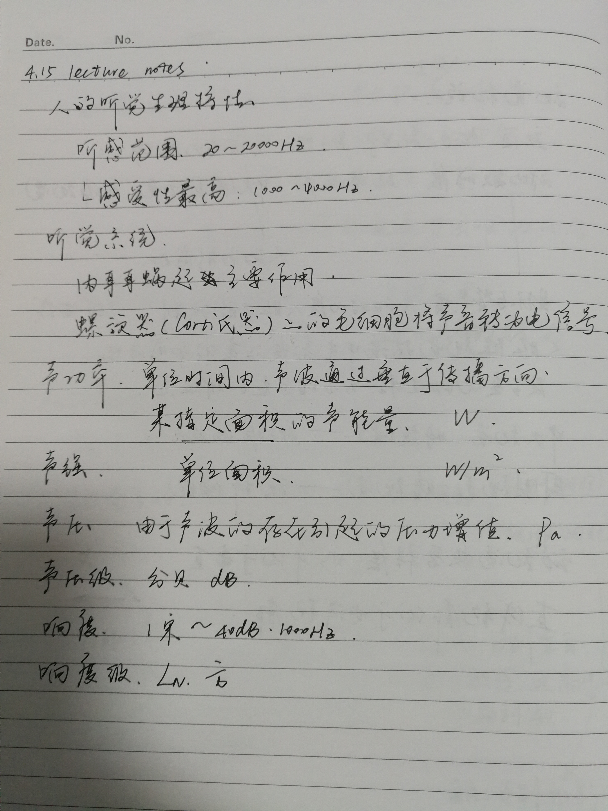
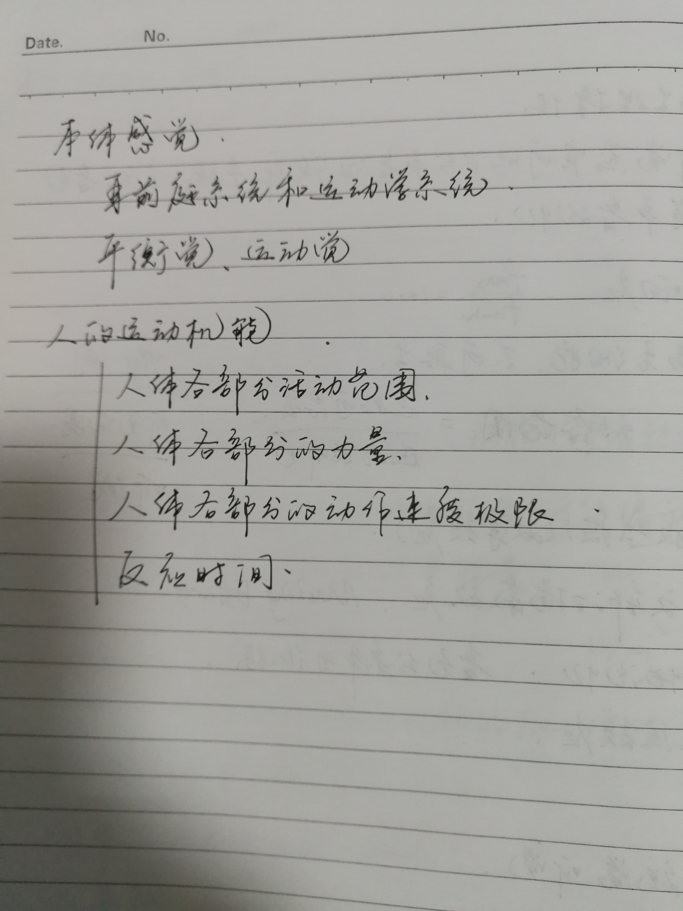

# 4.15 lecture notes

## 问题

+ **Corti 氏器是什么？**

  Corti 氏器是位于耳蜗膜蜗管基底膜上的螺旋器，自蜗底至蜗顶全长约 32mm，由内、外毛细胞，支柱细胞和盖膜是听觉感受器的主要成分。靠蜗轴侧有单排内毛细胞，其外侧有 3 排或更多的外毛细胞，这些都是听觉感受细胞。基底膜不同部位毛细胞的高度不一，从蜗底至蜗顶其毛细胞逐渐变高。在蜗底（高频端）毛细胞的静纤毛短，靠近蜗顶静纤毛逐渐边变长。这些耳蜗毛细胞的高度以及静纤毛长度的梯度变化，很可能是产生耳蜗音频排列和调谐功能的形态学基础。

