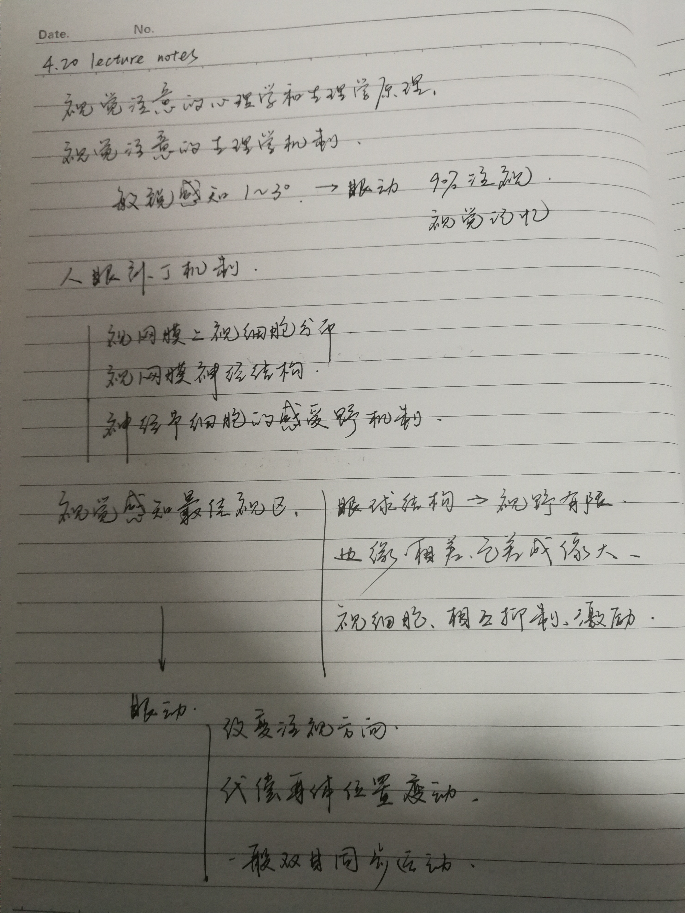
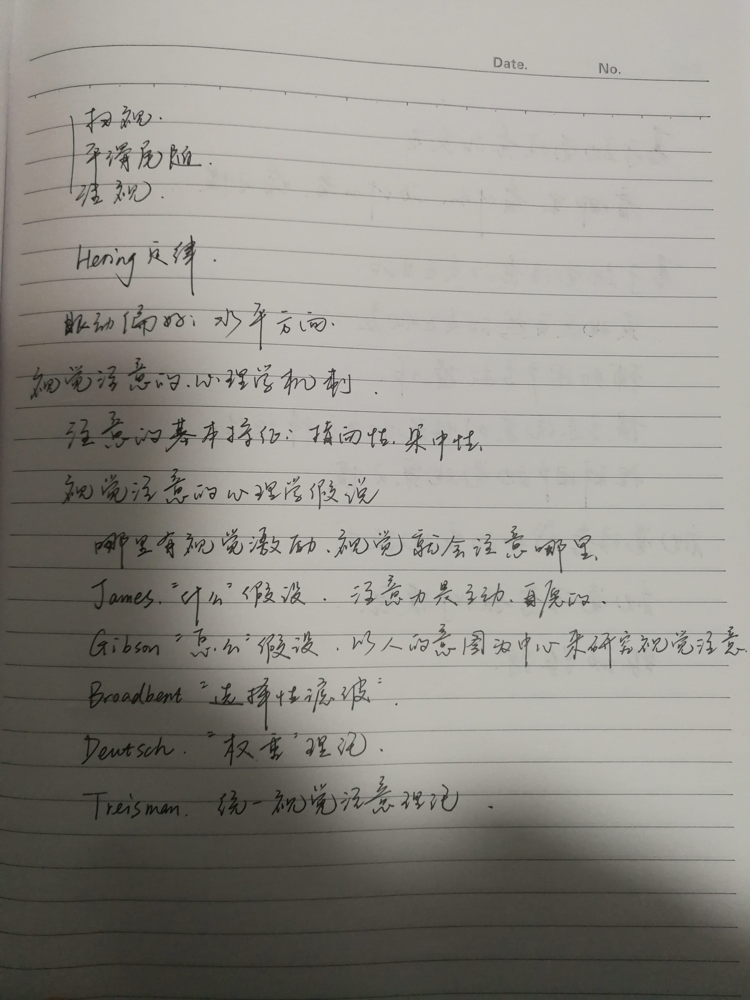
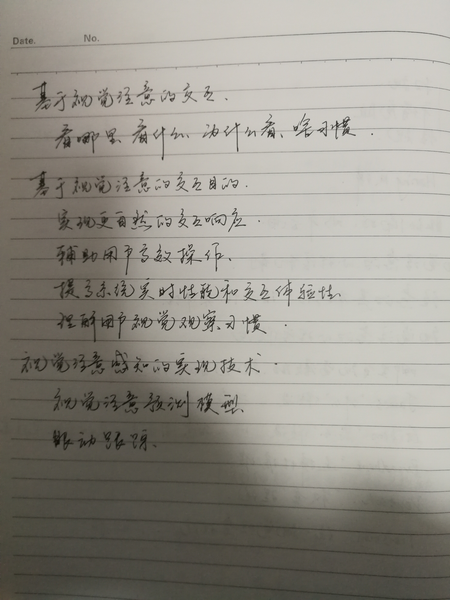

# 4.20 lecture notes

## 问题

+ **Hering 定律是什么？**

  Hering 定律 ，又称配偶肌定律，任何起自中枢神经系统使眼球转动的神经冲动，一定同时和等量地抵达双眼；神经冲动的大小是由注视眼决定的。这个定律适用于双眼的眼外肌，例如当中枢神经系统传出使眼球向右看的神经冲动时，这种神经冲动并不单纯地支配右眼球，它也使配偶肌(左内直肌)收缩，同时还使后者的直接对抗肌(左外直肌)松弛，否则对抗肌的反抗和协同肌的不协调会使眼球的运动颤动和固定不好。