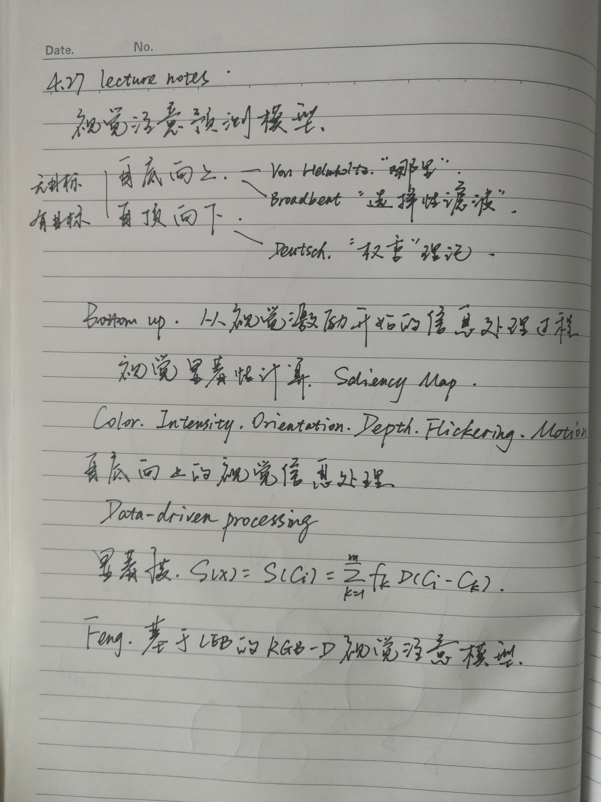
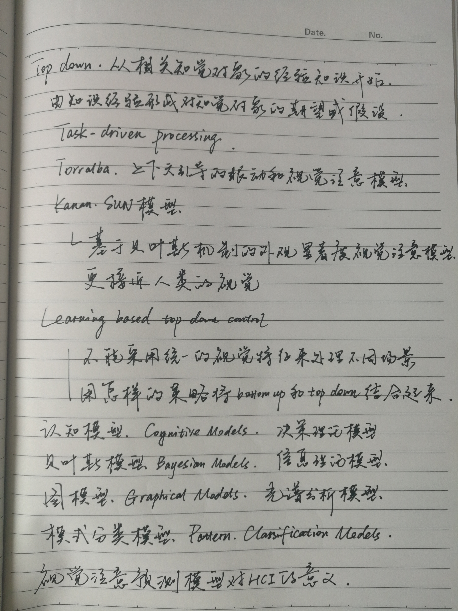

# 4.27 lecture notes

## 问题

+ **赫布理论是什么？**

  赫布理论（Hebbian theory）是一个神经科学理论，解释了在学习的过程中脑中的神经元所发生的变化。赫布理论描述了突触可塑性的基本原理，即突触前神经元向突触后神经元的持续重复的刺激，可以导致突触传递效能的增加。这一理论由唐纳德·赫布于 1949 年提出，又被称为赫布定律（Hebb's rule）、赫布假说（Hebb's postulate）、细胞结集理论（cell assembly theory）等。他如此表述这一理论：

  我们可以假定，反射活动的持续与重复会导致神经元稳定性的持久性提升，当神经元 A 的轴突与神经元 B 很近并参与了对 B 的重复持续的兴奋时，这两个神经元或其中一个便会发生某些生长过程或代谢变化，致使 A 作为能使 B 兴奋的细胞之一，它的效能增强了。