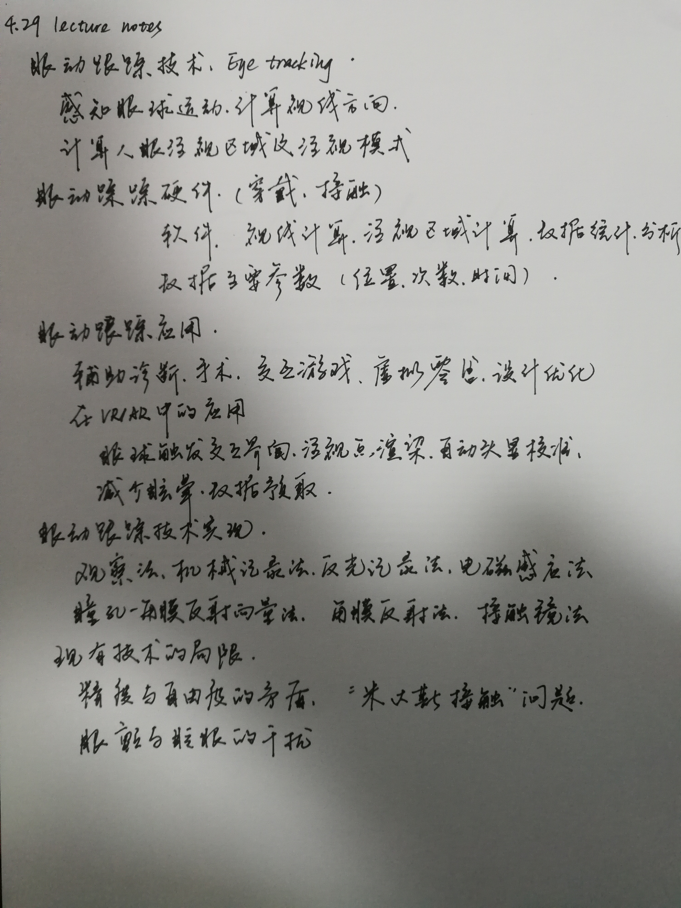
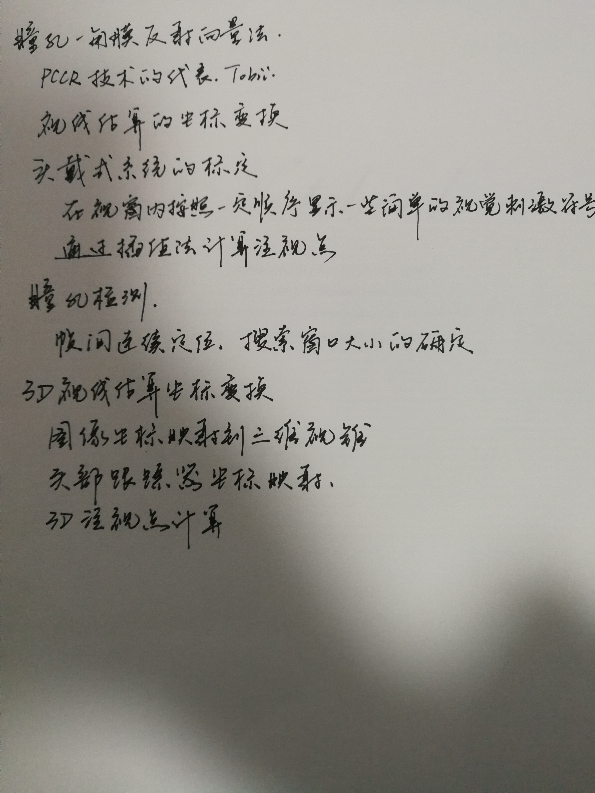

# 4.29 lecture notes

## 问题

+ **什么是“米达斯接触”问题？**

  米达斯是希腊神话中的一位能点石成金的国王，所谓米达斯接触（Midas Touch）问题指的是由于用户视线运动的随意性而造成计算机对用户意图识别的困难。用户可能希望随便看什么，并非存在目的和意义，更不希望每次转移视线都可能引发一个动作。因此，视线跟踪技术的挑战之一就是避免“米达斯接触”问题。