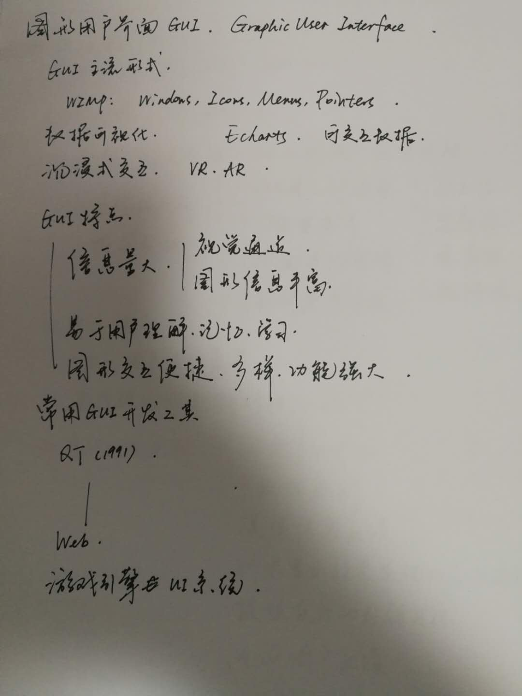

# 5.18 lecture notes

## 问题

+ **ECharts 有哪些交互组件？**

  ECharts 有很多的交互组件，一般经常用到的组件有这些：

  + **title**：标题组件，包含主标题和副标题。

  + **legend**：图例组件，展现了不同系列的标记(symbol)，颜色和名字。可以通过点击图例控制哪些系列不显示。

  + **xAxis**：直角坐标系 grid 中的 x 轴，一般情况下单个 grid 组件最多只能放左右两个 x 轴，多于两个 x 轴需要通过配置 offset 属性防止同个位置多个 x 轴的重叠。

  + **yAxis**：直角坐标系 grid 中的 y 轴，一般情况下单个 grid 组件最多只能放左右两个 y 轴，多于两个 y 轴需要通过配置 offset 属性防止同个位置多个 Y 轴的重叠。

  + **tooltip**：提示框组件，就是当你的鼠标悬浮在图表上的提示内容。

  + **toolbox**：工具栏组件。内置有导出图片、数据视图、动态类型切换、数据区域缩放、重置五个工具。

  + **series**：系列列表。我理解为数据列表。这里可以定义每组数据内容，以及数据的展现形式。

  + **timeline**：提供了在多个 ECharts option 之间进行切换、播放等操作的功能。

  + **dataZoom**：用于区域缩放，从而能自由关注细节的数据信息，或者概览数据整体，或者去除离群点的影响。