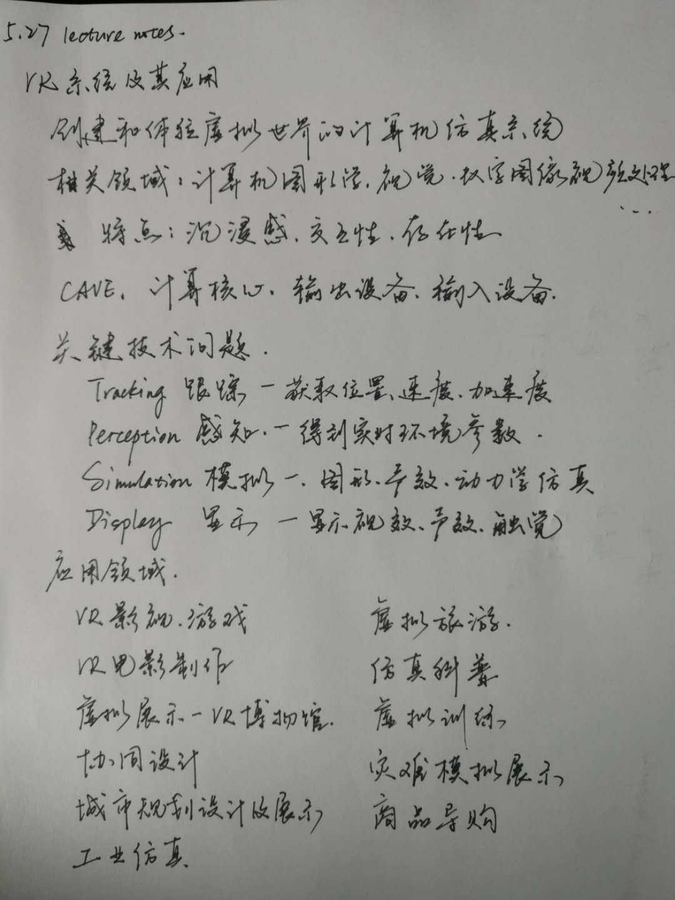

# 5.27 lecture notes

## 问题

+ **VR 设备有什么工业性应用？**

  工业领域里包含了各类机械重工的设计。矿业、石油开采、机械配件生产、装配车间等都需要精密的工业设计。VR 的应用为工业领域带来了更多的便利，例如工厂设计规划、协同设计审核等等。

  **工厂设计规划**

  在工厂设计阶段，通过 VR 设备，设计师与其他参与项目的人员可以虚拟的在厂房中观测与审核。这可以预知工人与工程师在工厂中是否可以舒适与高效的工作。在厂房设计阶段，设计师和管理者可以在同一环境下讨论工程布局与行走路线的布局。通过工厂的设计规划，公司可以最大化的提高生产线投产后的能效。

  **协同设计审核**

  大型的工业设计项目往往需要跨部门合作，例如一个大型的汽车生产线投产，就需要建筑设计团队、工业设计工程师已经市场团队合作，这类型的大型项目往往需要多人协同设计审核，目前比较流行的 VR 协同设计软件是法国 TechViz 科技公司提供的。该公司的软件可以支持多达 50 人的协调设计审核。团队可以在不同的物理位置对同一个 3D 模型进行审核。并在审核的过程中虚拟打标签，录制视频。