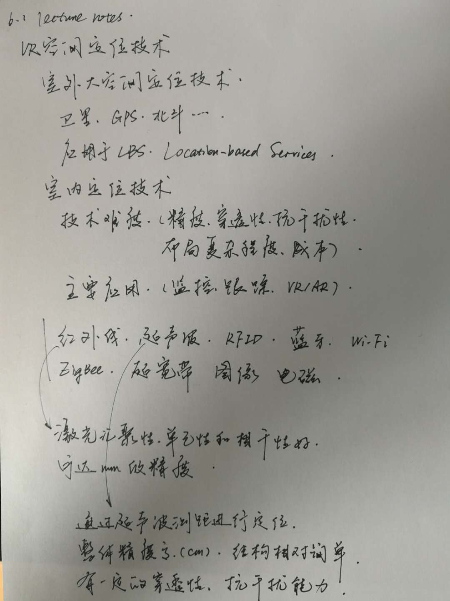
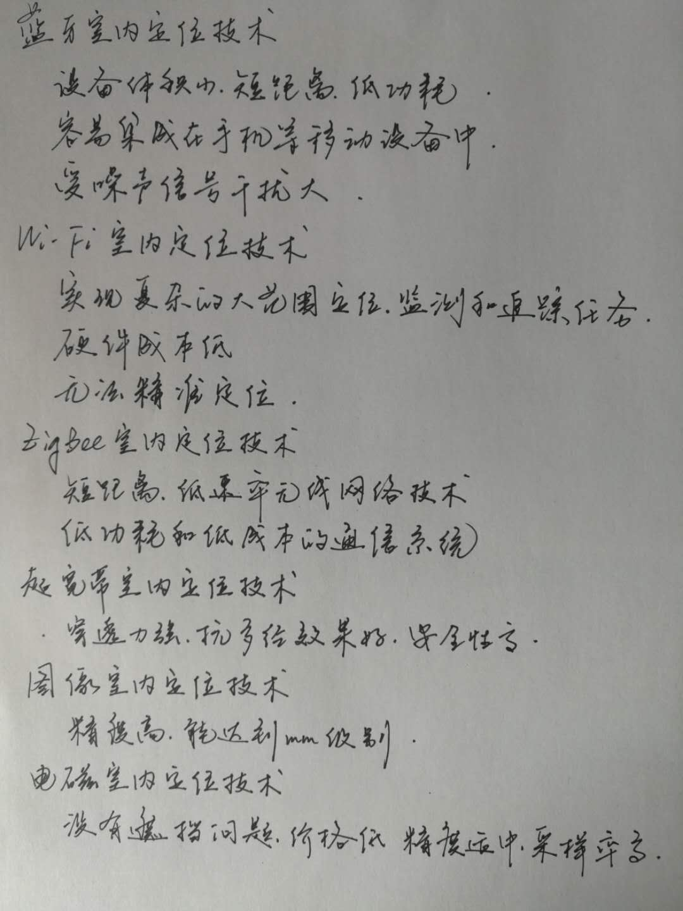

# 6.1 lecture notes

## 问题

+ **ZigBee 室内定位技术有哪些优缺点？**

  **优势：**功耗低、成本较低、延时短、高容量以及高安全，传输距离较长；可支持网状拓扑，树状拓扑和星型拓扑结构，组网灵活，可实现多跳传输。

  **缺点：**传输速率低，定位精度对算法要求较高。

  **适用：**目前 zigbee 系统定位已广泛应用于室内定位、工业控制、环境监测、智能家居控制等领域。