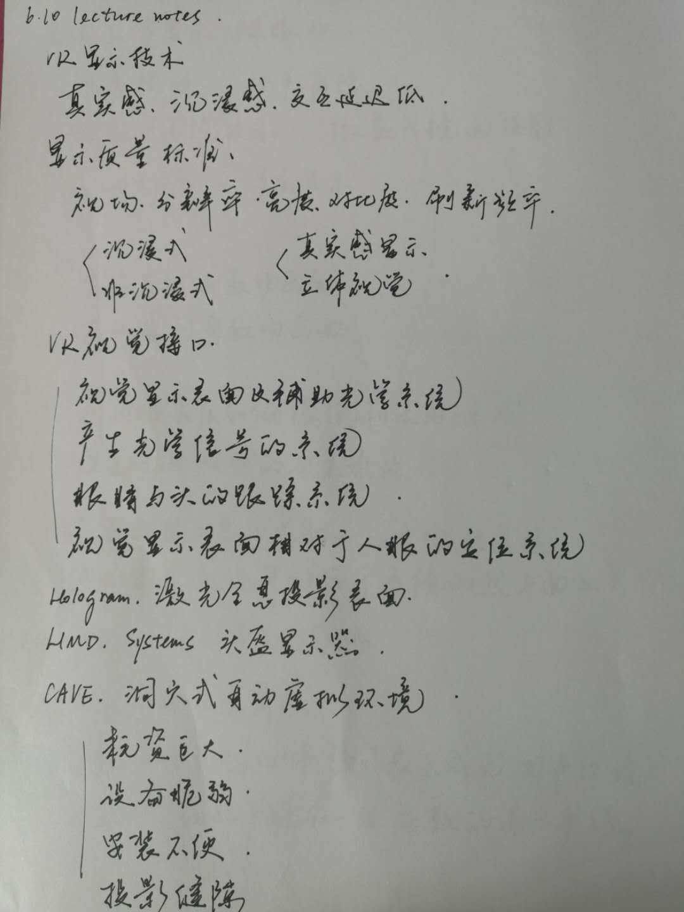
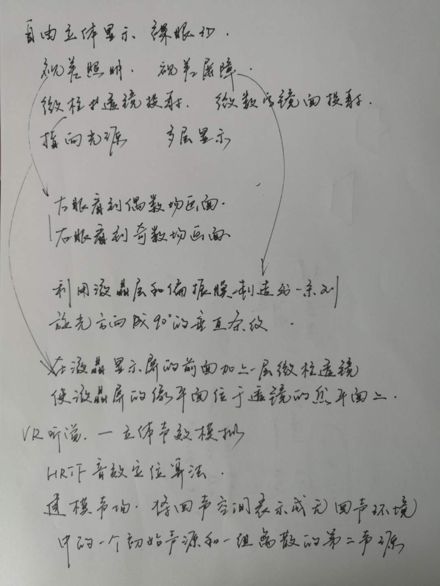

# 6.10 lecture notes

## 问题

+ **HRTF 音效定位算法是什么？**

  头部相关传输函数（Head Related Transfer Functions，缩写：HRTF）又称为 ATF（anatomical transfer function），是一种音效定位算法。

  HRTF 是一组滤波器，即利用 HD ITD（Interaural Time Delay）、IAD（Interaural Amplitude Difference）和耳廓频率振动等技术产生立体音效，使声音传递至人耳内的耳廓，耳道和鼓膜时，聆听者会有环绕音效之感觉。透过 DSP，HRTF 可实时处理虚拟世界的音源。