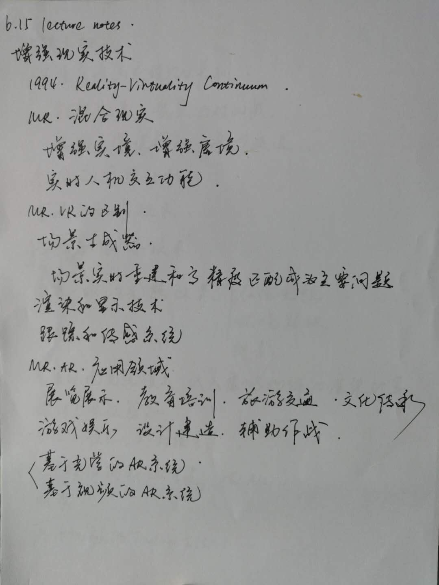
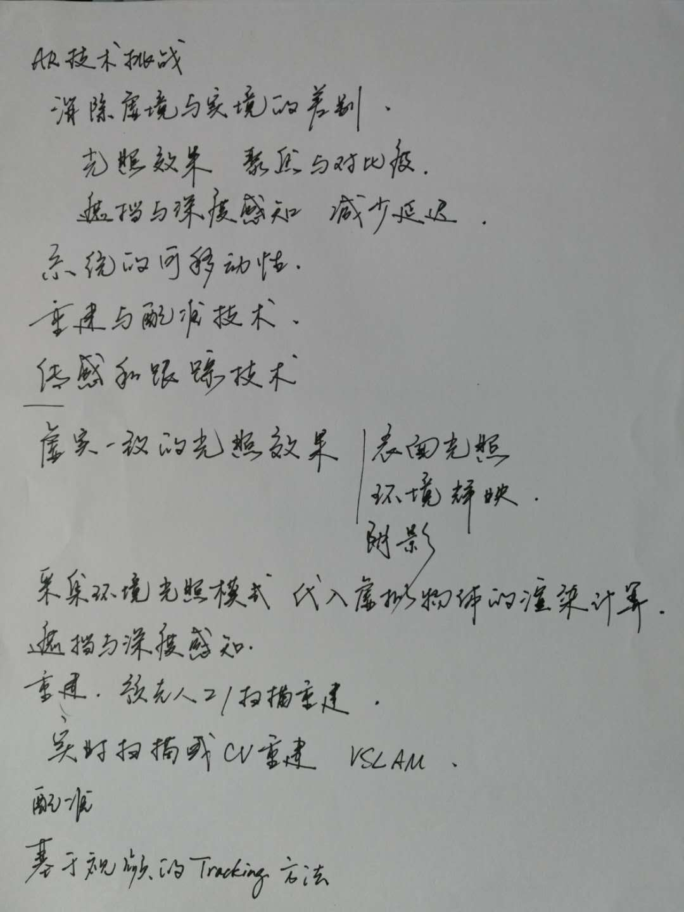

# 6.15 lecture notes

## 问题

+ **什么是 SLAM？**

  SLAM (Simultaneous Localization And Mapping，同步定位与地图构建)，主要为了解决移动机器人在未知环境运行时定位导航与地图构建的问题。

  事实上，SLAM 并不是某一种特定的算法，而是一个概念。SLAM 涉及多种研究方向，每个方向里面才涉及到多种算法。SLAM 基于应用层面可分为激光 SLAM 和 Visual SLAM（简称 VSLAM）。