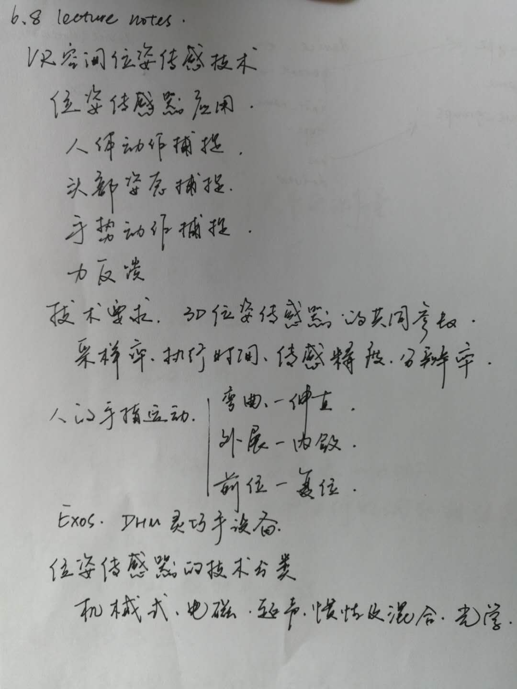
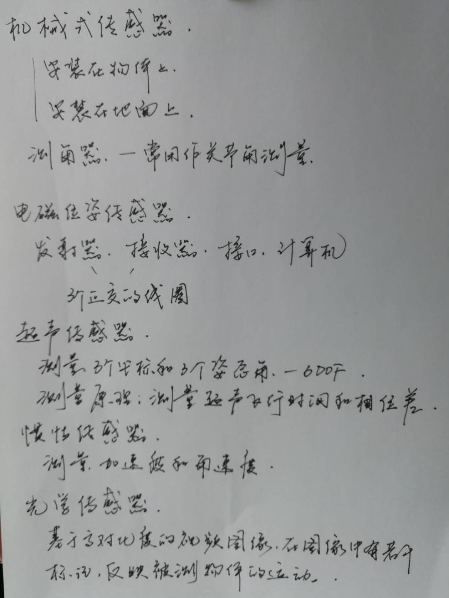

# 6.8 lecture notes

## 问题

+ **DHM 是什么？**

  1990 年 Exos 公司推出的 Dextrous Hand Master 是戴在用户手背上的金属外骨架结构。

  每个手指有 4 个传感器，五个手指就有 20 个传感器。每个角度由安装在机械结构关节上的霍尔效应传感器测量。结构的设计很仔细，使手组织柔软性的影响最少。专门设计的夹紧弹簧和手指支撑保证在手的全部运动范围内设备的紧密配合。设备是用可调的 Velcro 带子安装在用户手上。附加的支撑和可调的杆使之适应不同用户手的大小。这些复杂的机械设计造成了高成本（至今最昂贵的传感手套）。

  DHM 的传感器信号送到信号调节盒，然后以 100 位置/秒的速率被连到用户接口的 A/D 转换器采样。DHM 的高传感速率以及高传感分辨率，是与 DataGlove 相比的优点。但是它也在精度和校准上存在与其它手套类似的问题。

