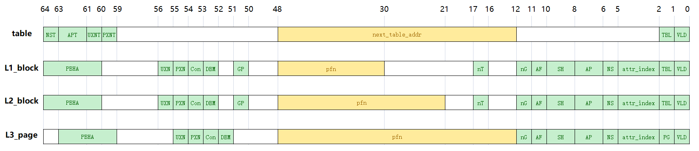

# OS lab notes

## Lab 1  Booting a machine

+ printf 只有 10 进制可以加负号

### Exercises

1. 阅读文档

2. ```bash
   (gdb) where
   #0  0x0000000000080000 in _start ()
   ```

   `_start()` 函数定义在 `start.S` 文件中

3. 对于 secondary processors，`start.S` 中的处理是用一个无限递归给他 hang 住：

   ```assembly
   secondary_hang:
   	bl secondary_hang
   ```

   一开始我在想为什么用 `bl` 而不用 `b`，无限递归的话栈不会越长越大吗，后来一想可能是因为 AArch64 中返回地址是保存在寄存器中的（但是似乎用 `b` 也不是不可以啊）

4. pointer warmup

5. `init` 段的代码 VMA 和 LMA 相同，而 `.text` 段的代码 VMA 和 LMA 不同：

   ```
   Name     Size      VMA               LMA             
   init     00049680  0000000000080000  0000000000080000
   .text    00000760  ffffff00000cc000  00000000000cc000
   ```

   经过一番学习，了解到 LMA 为代码在内存中存储（加载）的地址，而 VMA 为代码运行时的地址，它们是由链接器脚本决定的，也就是 `.lds` 文件：

   ```
   . = TEXT_OFFSET;
   init : {
   	${init_object}
   }
   
   . = ALIGN(SZ_16K);
   init_end = ABSOLUTE(.);
   
   .text KERNEL_VADDR + init_end : AT(init_end) {
   	*(.text*)
   	. = ALIGN(SZ_16);
   }
   ```

   这是该脚本中的一段代码，有几点可以解释上面 `objdump` 出来的信息：

   + `.` 表示当前位置，第一行将其赋值为 `TEX_OFFSET`，而 `TEXT_OFFSET` 宏在 `image.h` 中被定义为 `0x80000`，所以 `init` 段的地址为 `0x80000`，且默认 VMA 和 LMA 相同。
   + `init_object` 在 `CMakeLists.txt` 中被设置为 boot loader 相关的目标文件，所以 `init` 段中存储的是 boot loader 相关的代码
   + `init` 段起始地址为 `0x80000`，大小为 `0x49680`，再加上 `SZ_16K`（在 `image.h` 文件中被定义为 `0x4000`）的对齐，可以得到 `init_end` 的值恰好为 `0xcc000`
   + `.lds` 文件的语法规定了 section name 后可选地跟一个 VMA，然后是冒号，再然后是 AT(LMA)，经过计算 `.text` 段的 VMA 和 LMA 恰如以上信息中所示
   + `.text` 段的内容使用通配符匹配所有目标文件的 `.text` 段，在 `CMakeLists.txt` 中 `kernel` 目录被 include 了进来，所以 `.text` 段中存储的是 kernel 相关的代码。
   + kernel 相关的代码在运行的时候存储在高地址，所以 VMA 会加上一个 offset，也即 `KERNEL_VADDR`

6. 实现 print 函数：将 n 不断的模 base，再除以 base，如此反复可以得到每个数位上的数以组成一个字符串，如果是负数要在末尾添一个负号，最后翻转一下整个字符串。

7. kernel stack 初始化在 `0xffffff00000d0100`，这段代码是在 `kernel/head.S` 中：

   ```assembly
   ldr     x2, =kernel_stack
   add     x2, x2, KERNEL_STACK_SIZE
   mov     sp, x2
   ```

   而 `kernel_stack` 是一个在 `kernel/main.c` 中声明的未初始化变量，所以存储在 `.bss` 段中。之前 `objdump` 出来的 `.bss` 段信息如下：

   ```
   Name      Size      VMA               LMA
   .bss      00008000  ffffff00000d0100  00000000000d0100
   ```

   又因为 `kernel_stack` 声明成一个 4 x 8K 的二维 char 数组，大小恰为 `0x8000`，所以可知整个 `.bss` 段中只有这一个变量，也就是说 `kernel_stack` 的运行时地址是 `.bss` 段的起始地址，即 `0xffffff00000d0100`。

   确认了 kernel stack 的位置以后，再通过加上一个 `KERNEL_STACK_SIZE` 的偏移（8K）来为栈预留空间。

8. `test_backtrace` 中每次递归调用就会将栈扩大 `0x20` 个字节，也就是 4 个 giantword 的大小，其中第 1 个（最靠下的）giantword 为 frame pointer，第 2 个 giantword 为 return address：

   ```assembly
   stp     x29, x30, [sp, #-32]!
   ```

   第 3 个 giantword 为上一层递归调用中的实参 x，第 4 个 giantword 没有用到（栈指针 16 字节对齐）：

   ```assembly
   str     x19, [sp, #16]
   ```

9. 如上一问所述，当发生 function call 的时候，栈会扩大，栈指针会更新，x29 保存在最靠下的一个 giantword（也即新的 sp 所指位置），往上一个 giantword 保存 x30（也即 sp+8 的位置），再往上则是实参（sp+16 往上） 

10. 实现 `mon_backtrace` 函数：从当前的 frame pointer 开始，除 `mon_backtrace` 本身以外，最新的帧的 FP 为该帧最后一个 giantword 的地址，LR 为该帧倒数第二个 giantword，实参则存储在下一帧从倒数第三个 giantword 开始的空间中。如此循环，直到某一帧的 FP 为 0 为止。

## Lab 2  Memory Management



### Questions

1. 在 `mm.c` 中的 `mm_init` 中的这段代码指定了物理内存的布局：

   ```c
   free_mem_start = phys_to_virt(physmem_map[0][0]);
   free_mem_end   = phys_to_virt(physmem_map[0][1]);
   npages = (free_mem_end - free_mem_start) / (PAGE_SIZE + sizeof(struct page));
   start_vaddr = (free_mem_start + npages * sizeof(struct page));
   start_vaddr = ROUND_UP(start_vaddr, PAGE_SIZE);
   ```

   而 `global_mem` 结构体维护了这一信息。

2. x 的类型是 `vaddr_t`，对变量取地址取到的是虚拟地址。

3. 每一个 4K 页就需要一个 8B 的 PTE，overhead 大概是 0.2%

   arm 的 PTE 提供更多 attribution，内核态和用户态有更好的隔离性

4. 因为内核代码有更好的 locality，使用 block 可以减少页表过多带来的 overhead。boot 用到的虚存需要在加载内核之前映射。

   避免用户态进程对内核数据的读取或修改。PTE 中的 UXN、AP 以及两个 TTBR 的设计都试图进行这一保护。

### Challenge

我对两个 challenge 的理解是要支持 4K，2M，1G 大小的页的分配，我的实现方式是利用 `map_range_in_pgtbl` 函数中的 `flags` 入参标识分配的页的大小：

```c
int map_range_in_pgtbl(vaddr_t *pgtbl, vaddr_t va, paddr_t pa,
		       size_t len, vmr_prop_t flags);
```

在 `mmu.h` 中新增以下两个宏定义：

```c
#define VMR_BLK_2M (1 << 4)
#define VMR_BLK_1G (1 << 5)
```

如果 `flags` 中 `VMR_BLK_1G` 这一位被置上，就分配 1G 的 block；如果 `VMR_BLK_2M` 被置上，就分配 2M 的 block；如果都没有就分配 4K 的 page。然后根据大小不同做不同的处理，例如走几级页表，PTE 的第二位置 0 还是置 1。

## Lab 3  User Processes

### Exercises

1. + 将每个 segment 的 `p_memsz` 以 `p_align` 对齐 round up 的结果作为 pmo 的 size，并且将 elf 中相应 `p_offset` 处的长为 `p_filesz` 的数据 memcpy 到 pmo 对应的内存中
   + 将 stack，func 以及 SPSR_EL1_USER 分别赋给主线程 context 中对应的寄存器
   + 返回主线程 context 的地址，即内核栈中 context 的位置，而不是 context 中 SP_EL0 寄存器的值。因为在 `exception_table.S` 中可以看到用于 eret 中确定 pc 值的 sp_el0 寄存器被赋成了 sp 加上一个偏移量，而 sp 是传入的栈指针并且 context 是初始化在内核栈上的，所以应该传入内核栈上的一个位置。

2. 首先创建第一个进程，包括进程和 vmspace 的 object；然后创建该进程中的主线程，其中先初始化一个 pmo，然后将其与 vmspace 中的某个 vmregion 绑定，之后加载 elf 并将其拷贝到对应的 pmo 中，最后填入主线程的其他一些信息，例如属于哪个进程，拥有的 vmspace，以及 context。

   + `process_create_root`
     + `ramdisk_read_file`
     + `process_create`
       + `process_init`
       + `vmspace_init`
     + `thread_create_main`
       + `pmo_init`
       + `vmspace_map_range`
       + `load_binary`
       + `prepare_env`
       + `thread_init`
       + `flush_idcache`

3. + 首先在 `exception_table.S` 中找到 `el1_vector` label，此处即为 exception vector table 的起始位置（虽然不知道 EXPORT 具体是干嘛用的），然后列出 16 个 table entry 即可，因为 `exception_entry` 宏中定义好了 0x80 的对齐。
   + 在 `exception.S` 中可以看到 `vabr_el1` 被赋值成 `el1_vector` 的位置，在 `exception_init_per_cpu` 中调用一下这个函数即可。
   + 在 `handle_entry_c` 的 switch 语句中增加一条 `case ESR_EL1_EC_UNKNOWN:` 用来处理 `UNKNOWN`

4. 首先拿到 `syscall_table` 的基地址，然后将 syscall number 乘上一个 8 （一个指针长）作为偏移量，两者相加即得到 handler 也就是 syscall table entry 的地址。

5. 写一段汇编，将前八个参数 mov 到 x0 ~ x7，然后 `svc 0`，最后从 x0 中取出返回值

6. `sys_exit`, `sys_create_pmo`, `sys_map_pmo` 的实现已经提供了，`sys_putc` 直接调用 `uart_send`

   `sys_handle_brk` 根据提供的注释，如果 addr 是 0，就初始化 vmr 和 pmo，如果 addr 比当前的堆顶高，就更新 vmr 和 pmo 的 size，但是并不立刻 alloc

7. 从 main 返回以后，执行流跳到了 `0x0`，因为 `_start_c` 的汇编中是 `b main` 而不是 `bl`，所以没有设置 LR （LR 为 0），就 `ret` 到了 `0x0`

8. 在 `_start_c` 最后加上 `usys_exit(0)`，这样会从 main 返回（`bl main`）然后优雅地退出。

9. 在 `handle_entry_c` 的 switch 语句中增加一条对 `ESR_EL1_EC_DABT_LEL` 和 `ESR_EL1_EC_DABT_CEL` 的处理，调用 `do_page_fault`。根据 `handle_trans_fault` 中的注释，首先拿到缺页 va 所对应的 vmr 和 pmo 并验证 pmo 的类型是否为 `PMO_ANONYM`，然后分配一个物理页并将其 commit 给 pmo（这里暂时采用 pa 作为 radix 的 index），最后将缺页 va 所在的虚拟页和刚刚分配的物理页映射起来。

##### Last-modified date: 2020.4.10, 1 p.m.

 